<div align="center">

# jitagent

**Stop your agent re-deriving the same function 200 times. Compile it once.**

[](https://github.com/Birfy/jitagent/actions/workflows/ci.yml)
[](https://pypi.org/project/jitagent/)
[](https://www.python.org/downloads/)
[](src/jitagent/corpus/)
[](LICENSE)
[](#known-gaps)



</div>

<details>
<summary>The same session as text (it is a real transcript — <code>tools/capture_demo.sh</code> produced it)</summary>

```console
$ jitagent compile examples/rank.json --name rank
requirement  Rank {name, score} records from highest score to lowest. Records with the same…
seeds        5   model claude-haiku-4-5   backend cli   cache auto
miss: nothing reusable found
  wrote 8 extra test cases
    {"records": [{"name": "bob", "…   (Two separate tie groups; each sorted by name within…
    {"records": [{"name": "z", "sc…   (Negative scores rank below positive; highest to lowe…
      ! assumes something the requirement did not say: Scores can be floating-point numbers…
    {"records": [{"name": "a", "sc…   (Zero score is a valid boundary; tied zeros rank belo…
    {"records": [{"name": "a", "sc…   (Decimal scores compared with exact equality; 85.5 ≠…
  attempt 1  passed

  PASS  static                passed
  PASS  examples.sufficiency  13 case(s)
  PASS  examples              13/13 passed
  PASS  return_schema         passed

  level: VERIFIED   took: 65ms

result: ok   tokens 3692in/1680out
cache: miss   no hit; synthesised a new one
name rank   handle fn_8617fc1e2b62   v1   level VERIFIED
$ jitagent call rank '{"records":[{"name":"zoe","score":7},{"name":"amy","score":9}]}'
ok    v1
[
  {
    "name": "amy",
    "rank": 1
  },
  {
    "name": "zoe",
    "rank": 2
  }
]
$ jitagent list
NAME              VER    CASES   REQUIREMENT
rank              v1        13   Rank {name, score} records from highest score to lowest.
```

</details>

## Why this exists

Ask an agent to normalise 200 log files and it will reason its way through the problem 200
times. It is slow and it burns tokens — but the real problem is the third one: **on run 137
it can quietly do something different.** There is no diff to review, no test to run, and
nothing to point at when the output turns out wrong.

The work was never the hard part. Most of those steps are a pure function — parse, clean,
group, sum, format — and a function is something you can read, test, version and trust. The
model's judgement is worth paying for *once*, to write that function. It is not worth
paying for two hundred times to re-derive it.

So hand `jitagent` a sentence and a couple of examples. It writes the test cases out in
full, writes the code, runs it against every case in a sandbox, and stores the lot under a
name you choose.

| | in the agent | after `jitagent compile` |
| --- | --- | --- |
| per call | seconds, thousands of tokens | ~30ms, zero tokens |
| same input twice | may differ | identical |
| when it is wrong | re-read a transcript | read the function, add a test case |

That is what a JIT does to an interpreter, and it is where the name comes from: a hot path
should not be re-derived on every pass.

**The test cases are the asset, not the code.** The registry is organised around them; the
code is just an implementation that currently passes. A better model means a free
regeneration of everything you have.

---

## Quickstart

```bash
pip install jitagent        # the import name and the CLI are `jitagent`
jitagent selftest            # 6 corpus cases, each with a deliberately planted bug
```

`selftest` ships with the package and spends nothing. It is worth running on a new
machine: how the sandbox contains a memory bomb is platform-dependent, so "does this
behave here?" is a real question. To work on `jitagent` itself:

```bash
git clone https://github.com/Birfy/jitagent && cd jitagent
pip install -e ".[dev]"
pytest                       # 102 unit tests — no network, no tokens
```

Synthesis needs a model. If you have [Claude Code](https://claude.ai/code) installed,
`jitagent` shells out to it and uses its authorisation; otherwise set `ANTHROPIC_API_KEY`
and pass `--via api`.

A requirement is a JSON file: a sentence, plus a few examples that pin down what you mean.
The examples are the spec, not decoration — nothing without them reaches the cache.

```json
{
  "requirement": "Rank {name, score} records from highest score to lowest. Records with the same score share a rank, and the next rank skips accordingly (1, 1, 3 — not 1, 1, 2). Within a tie, order by name ascending.",
  "examples": [
    { "input":  { "records": [{"name": "alice", "score": 90},
                              {"name": "bob",   "score": 85},
                              {"name": "carol", "score": 90}] },
      "output": [{"name": "alice", "rank": 1},
                 {"name": "carol", "rank": 1},
                 {"name": "bob",   "rank": 3}] },

    { "input": { "records": [] }, "output": [], "boundary": true }
  ]
}
```

That is [`examples/rank.json`](examples/rank.json) — from a checkout, this runs as it
stands:

```bash
jitagent compile examples/rank.json --name rank   # write the cases, then the code
jitagent get     rank                             # print the source
jitagent call    rank '{"records": [...]}'        # run it in the sandbox
jitagent list                                     # what is in the registry
jitagent search  "rank records by score"          # is there one already?
jitagent inspect rank                             # cases, versions, verification report
```

The registry lives in `~/.jitagent/registry`; `JITAGENT_HOME` or `--home` moves it.

### From Python

```python
from jitagent import compile_function, get_code, call_function, Example
from jitagent.llm import ClaudeCliClient

compile_function(
    "Rank {name, score} records from highest score to lowest...",
    [Example({"records": [{"name": "alice", "score": 90}]}, [{"name": "alice", "rank": 1}]),
     Example({"records": []}, [], boundary=True)],
    name="rank",
    client=ClaudeCliClient(),
)

get_code("rank")                           # the source, as a string
call_function("rank", {"records": [...]})  # run it, 200 times if you like
```

`compile_function` takes any object with `complete(system=, user=)` — `ClaudeCliClient`,
`AnthropicClient`, or `ScriptedClient` (canned replies, which is how the tests run offline).
Your own model is one class with one method.

The library does not pick a backend for you: on a cache miss with no `client=` it raises
`NeedsClient` rather than quietly shelling out to something. Reading the cache and spending
tokens should not look the same from the outside.

---

## How a compile works

```
a sentence + a few seed examples
   │
   │  call 1  write the test cases   ← the code does not exist yet, so it cannot
   │                                   influence the cases
   │  call 2..4  write the code → static check → run every case
   │             → structured feedback → write it again
   ▼
stored: the cases + the code + the verification report
```

The obvious objection is circular reasoning: one model writing both the code and the tests
that judge it. Writing the cases **first** removes the strongest link — when they are
written there is no implementation for them to be shaped by. What it cannot remove is "the
same model misreads the requirement the same way twice", so:

- **Your seed examples are the anchor.** A generated case that contradicts one is dropped,
  and the drop is reported.
- **A failure only on generated cases is ambiguous** — the code may be wrong, or that
  case's expected value may be. It is handed back for you to adjudicate, not reported as a
  bug. Condemning correct code with a wrong case is far harder to debug than missing a bug.
- **A decision the requirement never made has to be declared** in an `assumes` field —
  which way `0.5` rounds, whether `""` counts as empty. Otherwise it silently becomes a
  criterion nobody knows is an assumption.

Generating cases makes the criteria **thicker, not more trustworthy.** Only your examples
do the second thing.

Three things can fail a synthesis and no more: the static check, one of the cases, or a
return value that breaks the schema inferred from your examples. The feedback is structured
— `input X / expected Y / actual Z / traceback` — never "that failed, try again".

---

## Does it actually work?

Both audits share one oracle: six **reference implementations, transcribed literally from
the requirement text and written before any generated case or any generated code existed.**
Both live in `tools/` and re-run.

**Audit 1 — are the generated cases right?** (`audit_tests.py`, `audit_traps.py`)

| | |
| --- | --- |
| generated expectations agreeing with the reference | **48 / 48** |
| planted traps exercised by at least one case | **18 / 18** |

The first number alone would mean nothing — a model that only writes `f([]) == []` scores
100% and has tested nothing. The second is what makes it worth reading: the traps are the
places each requirement is easy to misread (a `]` inside the message body, `start` later
than `end`, an empty dict that must be discarded, a duplicate `start`), and each is checked
**as a predicate over the case's input**, so a note claiming to test a tie cannot pass
without a tie in the data.

**Audit 2 — is the compiled function right?** (`audit_e2e.py`, 200 random inputs each)

| across 6 requirements × 2 rounds | |
| --- | --- |
| compiled successfully | **12 / 12** |
| passed on the first attempt | **12 / 12** |
| agreeing with the reference on every random input | **2400 / 2400** |

Two further runs came back the same, so across everything measured: **24 compiles, 4800
random inputs, no disagreement and no repair round used.** Both failure directions would
have been visible — too-weak cases missing a real bug, or a wrong case condemning correct
code. Neither happened.

<details>
<summary>The one time the repair loop fired, it was the sandbox's fault</summary>

The first time this audit ran, "count the working days" got stuck in both rounds: the first
attempt failed `examples: 0/10` and only recovered after feedback.

**It was not the model's mistake.** The two versions were logically identical and differed
by one API call: `datetime.datetime.strptime` cannot work inside the sandbox, because it
imports `_strptime` on first call and the restricted builtins have no `__import__`.

Fixing the sandbox means putting an `__import__` into it, which collides head-on with "no
holes in the sandbox" — saving one round of synthesis and wagering the whole boundary is a
bad trade. So the prompt tells the model to use `datetime.date.fromisoformat` instead.
Measured: 2-3 attempts down to 1, reproduced 3/3, wall clock halved. A test keeps the
limitation and the prompt in step, and goes red the day the limitation lifts.

The lesson generalises: **a gate that fires on correct code costs more than one that misses
a bug**, because nothing in the failure points at the real cause.

</details>

<details>
<summary>Vague requirements are the real risk — and where <code>assumes</code> came from</summary>

Every requirement above was written by one person and written precisely on purpose. Real
requirements are vague, and that is where the risk lives. A round on deliberately vague ones
split two ways:

- **Dodging it** — writing `1.5` but not `2.5` (both readings agree on `1.5`; only `2.5`
  forks). Safe, but it resolves nothing.
- **Asserting silently** — on "deduplicate a list of records", three decisions the
  requirement never made ("compare whole records", "keep the first", "preserve order") were
  written into the cases as settled fact. **This is the dangerous one**: a caller who read
  it the other way gets their correct implementation condemned.

Hence `assumes`. Re-running the same requirements afterwards, the behaviour inverted: `2.5`
was written, declaring "rounds away from zero". When a failure lands on such a case, the
report says plainly that this is not anyone being wrong — the requirement is
underspecified.

That specific experiment predates the translation and has not been repeated word for word.
What the English run shows is that the mechanism is live: **4 of the 6 requirements above
produced at least one declared assumption**, unprompted, on requirements written to be
precise.

</details>

---

## Reuse, and why the lookup is allowed to be crude

Compiling once saves nothing; the saving is in not compiling the second time. `jitagent
inspect` shows what is actually stored:

```console
$ jitagent inspect rank
-- test cases (13) --
  [caller]    {"records": [{"name": "alice", "score": 90}, … -> [{"name": "alice", "rank": 1}, …
  [caller]    {"records": []} -> []
  [generated] {"records": [{"name": "alice", "score": 10}, {… -> [{"name": "alice", "rank": 1}, …
      ! rests on something the requirement did not say: Scores can be negative and follow
        standard numerical ordering

-- versions --
 *v1  VERIFIED  2026-09-16T11:20:43  claude-haiku-4-5  1 attempt(s)  5017in/11773out
```

Five cases you wrote, eight the model added, one of them flagged. A year from now that flag
is the only thing that can answer "why is this the expected value?".

A call runs **param schema → sandbox → return schema**, both inferred from your examples,
and is a **pure read** — nothing is written to disk, so concurrent processes do not fight.

Lookup is three levels: **exact hash → candidate retrieval + re-run *this run's* examples →
miss, go synthesise.** One measurement shaped that. Comparing a requirement's
character-bigram overlap against three genuine rewrites (0.54 / 0.52 / 0.51) and against one
sentence changing only "sum" to "average" (**0.61**): **the one that behaves completely
differently is closer, as text, than any honest rewrite** — and embeddings put them just as
close, so vectors do not fix it.

Hence the rule: **retrieval affects the hit rate, re-verification decides correctness.** A
candidate must re-run your examples or it counts as a miss, so retrieval is allowed to be
crude — crude retrieval misses a few hits, it can never hand back a wrong function. And a
hit **merges your examples into the test set**, since they just passed re-verification.
Every cache hit thickens the function on its way past.

---

## What was cut, and why

**Of seven verification gates, not one ever caught a mistake a real model made.** Everything
they caught was a bug planted by hand in the corpus — they had been built by reasoning from
a document rather than forced into existence by a real failure.

Removed: hold-out splitting, the 100% branch-coverage threshold, fuzzing, determinism
checking, mutation testing, post-assertions, probes, quarantining, three-way version
ranking, `net_savings` accounting.

| | before | after |
| --- | --- | --- |
| lines under `src/` | 3647 | 2450 |
| one verification run | 727ms | 34ms |
| tunable parameters | 21 | 4 |

The reasoning for each is kept in [docs/correctness.md](docs/correctness.md) as written — it
is the argument any future addition has to beat. The most likely one to come back is the
hold-out split, which guards against a model writing `if input == X: return Y` against the
cases it can see; `verify.py` records what would trigger that.

---

## Known gaps

- **One model, three attempts maximum.** Every number rests on Claude Haiku 4.5.
- **The repair loop is untested by the audit.** 24 consecutive first-attempt compiles mean
  no real model has failed and recovered since the `strptime` fix, so `max_attempts = 3` is
  untested rather than validated.
- **The requirements and the audit oracle come from the same person.** Someone writing a
  requirement while knowing what they intend to test writes more clearly than they realise,
  and their reference implementation shares their reading. This audit cannot see past a
  misreading they and the model share.
- **The sandbox is a correctness sandbox, not a security one.** Restricted builtins, an AST
  allowlist, rlimits and a memory watchdog contain accidents, not a serious attacker. macOS
  ignores `RLIMIT_AS`, so the memory ceiling there rests on the parent polling RSS.
- **`datetime.strptime` does not work** inside it (above). Other lazily-importing standard
  library functions may share the problem; this is the only one hit so far.
- **The lexical similarity floor is script-dependent** — ~0.03 for unrelated requirements in
  Chinese, ~0.21-0.28 in English against a threshold of 0.20. It is a cost knob, not a
  correctness mechanism; the schema check and re-verification are what do the work.
- **Token counts through the CLI are estimates**: `claude -p` carries ~22.2k tokens of fixed
  overhead, subtracted, but the constant moves with the CLI version.

---

## The code

```
src/jitagent/
  jit.py            the product surface: compile / get_code / call / search / inspect
  propose.py        get the model to write the cases out — before the code, separate call
  prompts.py        the two prompts; the requirement sits in an untrusted data region
  synth.py          the loop: write → verify → structured feedback → write again
  verify.py         the static check, the cases, the return schema. Those three, no more
  static_check.py   the AST allowlist — the cheapest gate; failing it means no sandbox
  sandbox.py        subprocess execution plus the parent-side memory watchdog
  _child.py         the sandbox child; must be self-contained
  infer.py          infer a schema from examples (it can tell a record from a mapping)
  registry.py       storage: organised around the test set, versioned, fetched by name
  lookup.py         three-level lookup — retrieval narrows, re-verification decides
  runtime.py        calling: input guard → sandbox → return guard. A pure read
  llm.py            backends: the API, the local claude CLI, a scripted replay
  corpus/           6 corpus cases, one per gate — shipped, so selftest runs anywhere
tools/              the three audits, plus the demo capture and the SVG builder
tests/              unit tests; every one runs with no network and no tokens
```

| Document | Contents |
| --- | --- |
| [docs/design.md](docs/design.md) | the main design — interface, architecture, caching, sandbox, roadmap |
| [docs/correctness.md](docs/correctness.md) | correctness and testing — **what decides whether this stands up** |
| [docs/tracing-frontend.md](docs/tracing-frontend.md) | the front end that spots repetition and triggers a compile (not started) |
| [NEXT.md](NEXT.md) | what to do next, and what is deliberately not being done |
| [CONTRIBUTING.md](CONTRIBUTING.md) | how to run things, and what a new verification gate has to prove |

**Where to start reading:** the headers of `propose.py` (why one model judging itself is
circular, and which part of that cannot be fixed), `verify.py` (which five gates were cut
and why), `tools/audit_tests.py` (the audit protocol — the reference must be written *before*
any generated case is seen), and `lookup.py` (why crude retrieval is safe).
