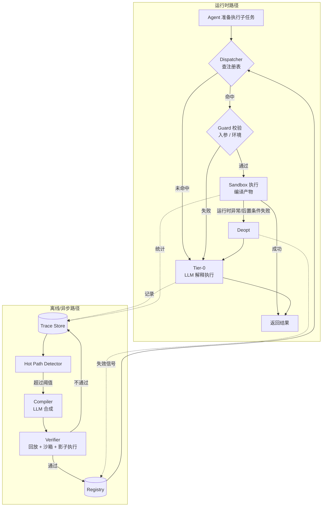

# Agent-JIT 设计文档

> 把 agent 在长程任务中反复"解释执行"的子任务，编译成可复用、可验证、可失效的代码单元。

| 字段 | 值 |
| --- | --- |
| 状态 | Draft |
| 版本 | 0.1 |
| 日期 | 2026-09-16 |
| 目标读者 | 实现者、集成方 |

---

## 1. 问题

一个 agent 在长程任务里的执行结构通常是这样的：

```
用户目标
 └─ 规划成若干步骤
     └─ 每个步骤：LLM 读上下文 → 决定调哪个 tool → 看结果 → 再决定 → ...
```

这套循环的本质是**解释执行**：每一次 tool 调用的决策，都要把上下文重新喂进模型、重新推理一遍。对于一次性任务这没问题，但长程重复任务里它有三个硬伤：

1. **成本线性增长。** 同一个子任务做 200 遍，就付 200 遍的推理 token。而这 200 遍的决策序列可能 95% 完全一样。
2. **延迟无法压缩。** 10 步 tool 调用 = 10 个来回的模型推理，每步都是秒级。而等价的代码是毫秒级。
3. **结果不稳定。** 每次重新推理就有重新犯错的机会。跑 200 遍，同一个子任务的行为会飘。这在批处理场景下是最致命的——你没法审计"这 200 条结果是用同一套逻辑产出的"。

这三点在编程语言里有一个成熟的、同构的解法：**JIT 编译**。解释器逐条解释字节码，JIT 发现热点后把它编译成机器码，之后直接跑编译产物；一旦运行时假设被打破（guard 失败），就去优化（deopt）回退到解释器。

Agent-JIT 把这套机制搬到 agent 上：**把热点子任务从"每次重新推理"编译成"一段代码 + 一组守卫条件"，之后直接执行代码；守卫失败就回退到 LLM 路径，并触发重编译。**

---

## 2. 核心类比

这个类比不是修辞，是设计的骨架。每一栏都对应一个要实现的组件。

| 编译器/JIT 概念 | Agent-JIT 对应物 |
| --- | --- |
| 字节码 | agent 的 tool-call 轨迹（trace） |
| 解释器 | LLM 推理循环（Tier-0） |
| 热点探测计数器 | 子任务签名的成本加权频次 |
| trace recording | 轨迹记录器 |
| 编译成机器码 | LLM 合成参数化函数（Tier-2） |
| 内联缓存（inline cache） | 编译产物里保留的受控 LLM 槽位（Tier-1） |
| guard（类型守卫） | 前置条件：入参 schema、环境断言 |
| deoptimization | guard 失败 → 回退 LLM 路径 |
| code cache | 编译产物注册表（Registry） |
| PGO（profile-guided opt） | 运行统计驱动的重编译 |
| 分层编译 | Tier-0 纯 LLM / Tier-1 计划缓存 / Tier-2 代码 |
| 内联（inlining） | 把被调用的小 unit 展开进父 unit |
| OSR（栈上替换） | 执行到一半时切换到编译路径（**不做**，见非目标） |

**最重要的一条是 deopt。** 没有可靠的回退，这个系统就是个会悄悄做错事的缓存。有了 deopt，最坏情况只是退化成今天的 agent——慢一点，但不会错。所有设计权衡都以"保住这条性质"为第一优先级。

---

## 3. 目标与非目标

### 3.1 目标

- G1 **正确性不低于 Tier-0。** 编译路径的结果必须与 LLM 路径等价，否则宁可不走编译路径。
- G2 **成本显著下降。** 在重复度高的工作负载上，端到端 token 消耗下降 ≥ 60%。
- G3 **延迟显著下降。** 命中编译产物的子任务，延迟下降一个数量级。
- G4 **可审计。** 每个编译产物都能回答：它从哪些轨迹编译而来、验证过什么、被谁批准、执行过多少次、失败过几次。
- G5 **安全边界明确。** LLM 生成的代码在受限能力集内执行，破坏性操作不自动编译。
- G6 **不污染上下文。** 编译库长到 500 个单元时，进 prompt 的仍然只有签名摘要，不是代码。

### 3.2 非目标

- N1 **不做通用 program synthesis。** 只从真实发生过的轨迹里提炼，不凭空造功能。
- N2 **不追求全自动上线破坏性操作。** 涉及删除、付款、对外发送的 unit 需要显式人工批准。
- N3 **不做 OSR。** 一个子任务要么从头走编译路径，要么整个走 LLM 路径。执行到一半切换的复杂度收益比太差。
- N4 **不替代 agent 的规划能力。** Agent-JIT 只管"执行层"，不管"这个任务该怎么拆"。
- N5 **首版不做跨用户/跨租户的编译产物共享。** 数据边界问题另议。

---

## 4. 架构总览



两条路径是解耦的：运行时路径永远可用（最坏就是全走 Tier-0），离线路径只是在后台慢慢把热点变快。**编译失败、验证失败、注册表挂掉，都不应该影响 agent 完成任务。**

---

## 5. 组件设计

### 5.1 Tracer（轨迹记录器）

挂在 agent 的 tool 调用链路上，记录每一次调用的结构化事件。

```python
@dataclass
class TraceEvent:
    trace_id: str
    seq: int
    ts: float
    kind: Literal["tool_call", "tool_result", "llm_step", "task_begin", "task_end"]

    tool: str | None                 # tool 名
    args: dict                       # 入参（脱敏后）
    result_digest: str               # 结果哈希，大结果不全存
    result_preview: Any              # 截断后的结果，供编译器理解语义

    # 关键：数据来源追踪
    provenance: dict[str, ValueOrigin]   # args 里每个值从哪来

    cost: Cost                       # input/output token、墙钟时间、$ 
    effects: EffectClass             # 见 §8.2
```

**`provenance` 是整个系统里最有价值的一个字段**，§6.2 会展开为什么。

记录开销必须可忽略：异步写入、采样可配、大结果只存摘要。Tracer 挂掉不能影响主流程。

### 5.2 子任务边界：编译单元从哪来

JIT 有两种流派：method JIT（以函数为单位）和 tracing JIT（以热循环路径为单位）。Agent-JIT 两种都要，但分阶段。

| 策略 | 边界来源 | 可靠性 | 阶段 |
| --- | --- | --- | --- |
| **显式边界** | agent 主动声明 `with jit.subtask("拉取月度报表", params={...})` | 高 | M1 |
| **结构边界** | plan step / TODO 项 / subagent 调用 的天然边界 | 中高 | M1 |
| **挖掘边界** | 从 tool-call 序列里挖频繁连续子序列 | 中 | M3 |

先做前两种。理由：显式和结构边界自带语义标签（"拉取月度报表"），这既是热点计数的 key，也是后续检索的 key，还是编译时给 LLM 的意图说明。纯挖掘出来的子序列没有名字，得反过来让 LLM 猜它在干什么，噪声大得多。

### 5.3 任务签名（TaskSignature）

热点计数和缓存查找的 key。一个签名不是一个字符串，是个多层结构：

```python
@dataclass(frozen=True)
class TaskSignature:
    intent: str            # "把某月的原始 CSV 汇总成 JSON 报表"
    intent_embedding: Vector
    shape_hash: str        # 规范化后的 tool 调用骨架哈希
    tool_set: frozenset[str]
    param_schema: JSONSchema
```

- `shape_hash` 做精确匹配：把轨迹里的具体值全抽成占位符后，`read→transform→write` 这个骨架的哈希。快、准、零成本。
- `intent_embedding` 做模糊匹配：处理"同一件事换个说法"。

查找时先试 `shape_hash`，再试向量近邻 + 重排。

### 5.4 Hot Path Detector（热点探测）

不是简单数次数。JIT 的 hotness counter 也是加权的，这里用**成本加权**：

```
hotness(sig) = Σ_over_observations (tokens_spent + λ · wall_clock)
```

触发编译的条件：

```
hotness(sig) > K · estimated_compile_cost(sig)
  AND  observations(sig) >= N_min          # 至少见过 N_min 次，保证有对齐样本
  AND  variance(sig) < V_max               # 轨迹之间不能差异太大
  AND  max_effect_class(sig) <= IDEMPOTENT_WRITE   # 破坏性的不自动编译
```

- `K` 是回本倍数，建议起步 3.0：预计能省下 3 倍编译成本才值得编。
- `N_min` 建议 3。少于 3 条轨迹做不了可靠的反合一（§6.2）。
- `variance` 用轨迹间的编辑距离衡量。差异太大说明这个"子任务"实际上是好几件事，应该拒绝编译而不是编出一个满是分支的怪物。

这里的关键设计判断：**宁可少编译，也不要编译出低质量产物。** 一个错误的编译产物的代价（悄悄产出错结果 + 排查成本）远高于一个没编译的热点（就是慢点）。

### 5.5 Compiler（编译器）

输入：N 条同签名轨迹 + provenance + tool schema。
输出：一个 `CompiledUnit`。

编译分三步，**都不是纯 LLM**：

1. **反合一（anti-unification，程序化）** — 对齐 N 条轨迹，找出结构相同、取值不同的位置。这些位置是参数候选。这一步是确定性算法，不是让模型猜。
2. **参数/常量判定（provenance 驱动）** — 见 §6.2。
3. **代码合成（LLM）** — 把骨架、参数表、tool schema 和几条真实轨迹样例给模型，让它产出代码。模型在这里做的是"填充逻辑和错误处理"，而不是"从零设计"，任务被压得很窄，可靠性高得多。

```python
@dataclass
class CompiledUnit:
    id: str
    signature: TaskSignature
    version: int

    code: str                      # Python 源码
    entry: str                     # 入口函数名
    param_schema: JSONSchema
    return_schema: JSONSchema

    guards: list[Guard]            # §7
    capabilities: CapabilitySet    # 允许调用的 tool 白名单 + 调用次数上限
    effect_class: EffectClass

    provenance: CompileProvenance  # 源轨迹 id、编译模型、编译时间、prompt 哈希
    verification: VerificationReport
    approval: ApprovalRecord | None

    stats: RuntimeStats            # 执行次数、deopt 次数、平均耗时、累计节省
```

### 5.6 Verifier（验证器）

见 §9，这是保住 G1 的地方。

### 5.7 Registry（注册表）

存编译产物，支持：按 `shape_hash` 精确查、按 embedding 近邻查、按 unit id 直取。带版本，旧版本保留（deopt 率飙升时可以回滚）。

### 5.8 Dispatcher（分发器）

agent 要执行一个子任务时，Dispatcher 决定走哪条路径。三种集成形态：

| 形态 | 机制 | 优点 | 缺点 |
| --- | --- | --- | --- |
| **拦截式** | 在 plan step 执行前自动匹配并替换 | 对 agent 透明，零 prompt 成本 | 误匹配风险，agent 不知道自己被换了 |
| **工具式** | 暴露 `jit.lookup(desc)` / `jit.run(id, args)` 给 agent | agent 有知情权和否决权 | 多一轮推理 |
| **技能式** | 编译产物注册成 skill，走现有 skill 机制 | 复用现有基础设施 | 受 skill 加载机制约束 |

**建议：MVP 用工具式，成熟后对高置信匹配（`shape_hash` 精确命中 + 验证充分 + deopt 率低）升级为拦截式。** 这对应 JIT 里从"保守内联"到"激进内联"的演进，且有明确的可观测指标来决定何时升级。

---

## 6. 关键机制

### 6.1 部分编译：不是所有步骤都能变成代码

这是本设计与"缓存 prompt"或"存 playbook"的根本区别，也是最容易被做错的地方。

一条真实轨迹通常长这样：

```
1. glob("data/2026-08/*.csv")          ← 纯机械
2. read_file(each)                      ← 纯机械
3. LLM: "从这些行里判断哪些是退款"        ← 需要判断
4. aggregate(rows)                      ← 纯机械
5. LLM: "给这份汇总写两句摘要"            ← 需要判断
6. write_file(report.json)              ← 纯机械
```

强行把第 3、5 步编译成代码 = 把模型的判断力硬编码成 if-else，必错。

**做法：编译产物是混合代码。** 机械步骤变成真代码，判断步骤保留为受控的 LLM 调用槽位：

```python
def run(month: str, ctx: Ctx) -> Report:
    files = ctx.tools.glob(f"data/{month}/*.csv")
    rows  = [r for f in files for r in parse_csv(ctx.tools.read_file(f))]

    # 未编译槽位：结构固定、prompt 固定、输出 schema 固定
    refunds = ctx.llm(
        template="REFUND_CLASSIFY_V3",
        rows=rows,
        schema=RefundVerdict,          # 强制结构化输出
    )

    summary_rows = aggregate(rows, refunds)
    note = ctx.llm(template="SUMMARY_V2", data=summary_rows, schema=Summary)

    ctx.tools.write_file(f"out/{month}.json", render(summary_rows, note))
    return Report(month=month, n=len(rows))
```

这正是 JIT 里的 **inline cache / runtime call**：编译后的代码遇到无法静态决议的操作时，调用运行时。收益依然巨大——6 次模型往返压成 2 次，且这 2 次的 prompt 是固定模板、输出是强 schema，可控性远高于自由推理。

**推论：不要用"能不能 100% 变成代码"作为编译门槛。** 门槛应该是"机械步骤占比是否够高"。建议阈值：机械步骤 ≥ 60% 才编译。

### 6.2 参数判定：provenance 比推断可靠

给定一条轨迹 `read("/data/2026-08/a.csv") → write("/out/2026-08.json")`，哪些是参数？

- 靠 LLM 看着猜：会猜对大部分，但错的那部分很难发现。
- 靠多轨迹反合一：可靠，但需要 ≥3 条轨迹，且只能发现"实际变化过"的位置。一个参数如果三次恰好都传同一个值，会被误判成常量。
- **靠 provenance：直接读出答案。**

Tracer 记录每个值的来源：

```python
class ValueOrigin(Enum):
    USER_INPUT      # 来自用户/上游任务的输入      → 几乎必然是参数
    UPSTREAM_OUTPUT # 来自本轨迹内前序 tool 的输出  → 中间变量，不是参数
    ENV             # 来自环境（cwd、当前日期、配置）→ 参数或环境 guard
    LITERAL         # 模型凭空写出的常量            → 常量，但要标记待审
```

判定规则：

| origin | 判定 |
| --- | --- |
| `USER_INPUT` | 参数 |
| `UPSTREAM_OUTPUT` | 中间变量，编译进代码 |
| `ENV` | 若跨轨迹变化 → 参数；否则 → 环境 guard |
| `LITERAL` | 常量；若跨轨迹变化过 → 升格为参数 |

**provenance + 反合一 双确认**：两者结论一致才自动编译；不一致则标记为低置信，要么多收集几条轨迹，要么走人工确认。这是个廉价且高收益的一致性检查。

### 6.3 轨迹规范化

算 `shape_hash` 和做反合一之前，轨迹要先规范化：

1. **值抽象** — 具体值 → 类型化占位符（路径、URL、日期、ID 各成一类）
2. **无关步骤剔除** — 失败后重试的步骤、被丢弃结果的探索性调用（"先 ls 看看"），编译时应保留还是剔除？**默认剔除失败重试，保留探索性只读调用**（它可能承载了实际的控制流判断）。此处需实测调参。
3. **顺序归一** — 无依赖的并列调用（并行读 5 个文件）排序归一，避免同一逻辑因顺序不同被算成不同签名。依赖关系从 provenance 图直接得到。
4. **循环折叠** — `read(a) read(b) read(c)` 折叠成 `for x in [a,b,c]: read(x)`。这是把"展开的循环"重新卷回去，直接对应 tracing JIT 的 loop detection。

---

## 7. Guard 与 Deoptimization

Guard 是"编译时假设"的运行时断言。**它必须比它保护的代码便宜得多**，否则就失去意义。

| Guard 类型 | 何时检查 | 成本 | 例子 |
| --- | --- | --- | --- |
| **入参 schema** | 每次执行前 | 微秒 | `month` 匹配 `^\d{4}-\d{2}$` |
| **环境前置** | 每次执行前（带 TTL 缓存） | 毫秒 | 目录存在、API 版本 == v2、依赖 tool 已注册 |
| **能力前置** | 每次执行前 | 微秒 | 所需 tool 全在当前会话可用 |
| **中途不变量** | 执行中 | 微秒 | 读到的 CSV 列名符合预期 |
| **后置条件** | 执行后 | 毫秒 | 输出符合 return schema、行数 > 0、写入文件确实存在 |

### 7.1 Deopt 流程

任一 guard 失败，或执行抛出未处理异常：

1. **立刻回退。** 丢弃编译路径的部分结果（若已产生副作用，见下），用 Tier-0 重跑整个子任务。对调用方而言这只是慢了，不是错了。
2. **记录 deopt 事件**：哪个 guard、什么输入、什么环境。
3. **更新计数器**，按策略处置：

```
连续 deopt >= 3        → 熔断，该 unit 标记 QUARANTINED，全部流量走 Tier-0
7 日 deopt 率 > 5%     → 标记 STALE，排队重编译
特定 guard 反复失败    → 把该 guard 的失败样本喂给重编译，让新版本覆盖这个情况
重编译连续失败 2 次    → 标记 RETIRED，不再尝试，留给人看
```

### 7.2 副作用与回退的冲突

回退重跑的前提是"重跑是安全的"。如果编译路径已经写了半个文件才 deopt，重跑就可能出问题。

约束：

- **只读 unit**：无条件可回退。
- **幂等写 unit**：可回退（重跑覆盖同样内容）。**编译器必须验证幂等性**，否则降级。
- **非幂等写 / 破坏性 unit**：不自动编译（§8.2）。若人工批准，则要求 unit 声明补偿动作，或把所有写操作收束到函数末尾的单次提交点（write-at-end），使 deopt 只可能发生在提交之前。

**write-at-end 是个强约束但很值。** 它把"回退安全"从运行时的祈祷变成了编译时的结构性保证。建议作为编译器对写操作的默认改写策略。

---

## 8. 安全模型

LLM 生成的代码在 agent 环境里执行，这是设计上的任意代码执行。安全不是附加项。

### 8.1 执行沙箱

生成的代码**不能直接访问宿主能力**。它拿到的只有一个 `ctx` 门面：

```python
class Ctx:
    tools: ToolFacade    # 只暴露该 unit capability 白名单内的 tool
    llm:   LLMFacade     # 只能用注册过的 prompt 模板 + 强制 schema
    log:   Logger
```

多层防御：

1. **AST 白名单** — 编译产物过静态检查：禁止 `import`（标准库子集由 runtime 预注入）、`eval`/`exec`、`__` 开头属性访问、文件/网络/子进程原语。不通过就拒绝注册。
2. **进程隔离** — 在独立子进程执行，无网络命名空间，文件系统只挂载必要路径，CPU/内存/时间配额。
3. **能力白名单** — `ToolFacade` 按 `CapabilitySet` 逐调用鉴权，并限制每个 tool 的调用次数上限（防失控循环）。
4. **预算熔断** — 单次执行的 token / 时间 / tool 调用总数硬上限，超了就杀掉并 deopt。

### 8.2 副作用分级

每个 tool 在注册时声明自己的副作用等级，unit 的等级 = 所含 tool 的最大值。

| 等级 | 含义 | 自动编译 | 自动上线 |
| --- | --- | --- | --- |
| `PURE` | 纯计算 | ✅ | ✅ |
| `READ_ONLY` | 只读外部状态 | ✅ | ✅ |
| `IDEMPOTENT_WRITE` | 幂等写（同参数重复执行结果相同） | ✅ | ✅（影子期后） |
| `NON_IDEMPOTENT_WRITE` | 追加、计数、创建带时间戳的资源 | ✅ | ❌ 需人工批准 |
| `DESTRUCTIVE` | 删除、付款、对外发送、不可逆变更 | ❌ | ❌ |

`DESTRUCTIVE` 不自动编译，不是因为技术上做不到，而是因为它的**错误代价与 deopt 机制不匹配**——deopt 的兜底是"重跑一遍"，而删除和转账重跑不了。

### 8.3 轨迹数据是不可信输入

轨迹里包含 tool 的返回内容——网页、文件、API 响应。这些内容会进入编译器的 prompt。

**因此：轨迹内容对编译器是数据，不是指令。** 具体措施：

- 编译 prompt 里，轨迹内容放在明确定界的数据区，并声明其不可信。
- `result_preview` 截断并剥离控制字符。
- 生成的代码过 AST 白名单——即使注入成功让模型写出了恶意代码，静态检查和沙箱是第二、三道防线。
- 编译产物里出现的硬编码 URL、路径、命令，全部列入人工审阅清单（正常编译产物不应该凭空冒出新的外部端点）。

### 8.4 敏感数据

轨迹会记录 tool 入参和结果，其中可能有凭据和 PII。

- Tracer 侧做脱敏：已知的凭据字段名直接丢弃，值层面跑一遍 secret 检测。
- 编译产物里若出现疑似凭据的字面量，**硬性拒绝注册**。凭据必须走 `ctx` 的运行时注入。
- Trace Store 加保留期（默认 30 天）与访问控制。

---

## 9. 验证

这是 G1 的实现处。四道关，逐级放行。

### 9.1 静态检查

AST 白名单、类型检查、schema 一致性、无凭据字面量、capability 声明与实际调用一致。**任何一项不过直接拒绝，不进入后续。**

### 9.2 轨迹回放（golden replay）

**免费且强力**：编译时用的那几条轨迹天然就是测试用例。

把 `ToolFacade` 换成从轨迹回放的 mock，跑编译产物，检查：

- 发出的 tool 调用序列与原轨迹一致（允许 §6.3 定义的等价重排）
- 最终输出与原轨迹一致
- 没有调用白名单外的 tool

对已编译的 LLM 槽位，回放时同样用录制的响应，先验证机械骨架正确；模型判断部分的稳定性由 §9.4 覆盖。

**留出保留集**：N 条轨迹里拿出 1 条不参与编译，只用于回放验证。这是最基本的防过拟合措施——防止编译器把样本轨迹背下来。

### 9.3 沙箱试运行

在隔离环境跑真实执行（只读 tool 用真实数据，写 tool 重定向到临时目录）。验证代码在非 mock 环境下确实能跑通、资源消耗在预算内。

### 9.4 影子执行（shadow mode）

新编译产物不直接接管流量。上线后一段时间内，**两条路径都跑**：Tier-0 的结果返回给用户，编译路径的结果只做比对。

```
一致率 >= 98%  且  样本数 >= 20   → 提升为主路径
一致率 <  98%                     → 回炉，把不一致样本作为反例喂给重编译
```

影子期要花双份钱，但它是唯一能在真实分布上验证等价性的手段。**建议只对 `IDEMPOTENT_WRITE` 及以下等级开影子执行**（写操作跑两遍需要额外隔离）。

比对不能用字符串全等——LLM 槽位的输出天然有措辞差异。用分层比对：结构化字段严格比对，自由文本比对语义相似度，tool 调用序列严格比对。

---

## 10. 上下文预算

编译库长到几百个单元时，不能全塞进 prompt。分级暴露：

| 层 | 内容 | 大小 | 何时进上下文 |
| --- | --- | --- | --- |
| L0 | 无 | 0 | 默认。Dispatcher 在 agent 之外做匹配 |
| L1 | 命中单元的 `intent` + 签名 + 一行说明 | ~50 token | 匹配命中时 |
| L2 | 完整 param schema + 使用示例 | ~300 token | agent 决定调用时 |
| L3 | 源码 | ~2000 token | 仅调试/人工审阅时 |

**默认不让 agent 看见整个编译库。** 检索在 agent 之外做，agent 只看到"有个现成的东西能干这件事"。这和 JIT 一样——被编译的代码不需要知道 code cache 的存在。

---

## 11. 数据模型

```python
class EffectClass(IntEnum):
    PURE = 0; READ_ONLY = 1; IDEMPOTENT_WRITE = 2
    NON_IDEMPOTENT_WRITE = 3; DESTRUCTIVE = 4

class UnitState(Enum):
    COMPILING; SHADOW; ACTIVE; STALE; QUARANTINED; RETIRED

@dataclass
class Guard:
    kind: Literal["param_schema","env","capability","invariant","postcondition"]
    expr: str          # 受限表达式，同样过 AST 白名单
    ttl_s: float | None
    on_fail: Literal["deopt"] = "deopt"

@dataclass
class VerificationReport:
    static_ok: bool
    replay: ReplayResult          # 含 held-out 轨迹结果
    sandbox: SandboxResult
    shadow: ShadowResult | None

@dataclass
class RuntimeStats:
    executions: int; deopts: int; consecutive_deopts: int
    p50_ms: float; p95_ms: float
    tokens_saved_cum: int
    last_deopt: DeoptRecord | None
```

---

## 12. 评估指标

没有这些指标，就没法判断系统是在帮忙还是在添乱。

**收益侧**
- `token_saved_ratio` — 相对纯 Tier-0 基线的 token 下降
- `p50/p95 latency` — 命中路径 vs Tier-0
- `hit_rate` — 子任务走上编译路径的比例
- `net_savings` — 累计节省 − 累计编译/验证/影子成本。**这个数转正之前，系统是净亏的。**

**健康侧**
- `deopt_rate` — 目标 < 2%
- `shadow_agreement` — 目标 ≥ 98%
- `compile_success_rate` — 进入编译的签名里最终上线的比例
- `time_to_hot` — 从第一次见到某签名到编译产物上线的时间

**正确性侧（一票否决）**
- `silent_divergence` — 编译路径产出了错误结果且 guard 没拦住的次数。**目标 0。任何非零都触发该 unit 立即隔离。**
- 一个固定回归任务集，每次编译器或 runtime 变更后全量重跑。

---

## 13. 路线图

| 阶段 | 内容 | 出口判据 |
| --- | --- | --- |
| **M0 — 骨架** | 数据模型、Tracer、Trace Store、CLI 查看轨迹 | 能完整记录一个真实长程任务的轨迹并可视化 |
| **M1 — 手动编译** | 显式子任务边界；`jit compile <sig>` 手动触发；静态检查 + 轨迹回放；Registry；工具式 Dispatcher | 手动编译一个真实子任务，回放通过，agent 能调用它并省下 token |
| **M2 — 自动化 + Guard** | 热点探测自动触发；guard 体系；deopt + 熔断；沙箱执行；影子执行 | 无人干预下自动编译出 ≥3 个 unit，deopt < 5%，silent_divergence = 0 |
| **M3 — 编译质量** | 反合一 + provenance 双确认；循环折叠；部分编译的 LLM 槽位；重编译反馈环 | 编译成功率 > 50%，`net_savings` 转正 |
| **M4 — 规模化** | 拦截式 Dispatcher；unit 内联；跨任务复用；人工审阅与批准流；破坏性 unit 的受控上线 | 在真实重复负载上 token 下降 ≥ 60% |

M0/M1 是能否立项的验证：**如果手动编译一个真实子任务都做不出正向收益，自动化只会放大亏损。**

---

## 14. 风险与开放问题

### 已识别风险

| 风险 | 影响 | 缓解 |
| --- | --- | --- |
| **静默错误** — 编译产物悄悄产出错结果 | 致命，摧毁信任 | guard + 影子执行 + held-out 回放 + silent_divergence 一票否决 |
| **编译成本吃掉收益** | 系统净亏 | 成本加权热点阈值（K 倍回本）；`net_savings` 作为一级指标持续监控 |
| **过拟合样本轨迹** | 编译产物只在见过的输入上对 | held-out 轨迹 + 影子执行 + `variance` 阈值 |
| **环境漂移** | 编译产物慢慢全部失效 | 环境 guard + STALE 重编译 + deopt 率监控 |
| **prompt 注入经由轨迹进入编译器** | 恶意代码进入编译库 | 数据/指令分离 + AST 白名单 + 沙箱 + 新增外部端点人工审阅 |
| **编译库腐化** | 几百个半废的 unit，检索质量下降 | RETIRED 清理策略；长期零命中的 unit 自动下线 |

### 开放问题

1. **`variance` 怎么量化才靠谱？** 轨迹编辑距离是起点，但"多了一次重试"和"少了一个关键步骤"的距离可能一样，语义权重不同。需要实测。
2. **LLM 槽位的输出稳定性如何纳入 guard？** 目前设计里槽位输出只受 schema 约束，schema 合法但语义错误的情况无法拦截。是否需要针对槽位做单独的置信度/一致性检查？
3. **编译单元的粒度上限在哪？** 编得太粗则复用率低，太细则收益小。是否需要自动的拆分/合并（对应 JIT 的 inlining 和 outlining）？
4. **跨会话/跨用户复用的数据边界。** 一个 unit 里可能编进了某个用户的目录结构。首版限定单用户，但复用价值主要在跨用户，这块要单独设计。
5. **人工审阅的成本如何控制？** 若 `NON_IDEMPOTENT_WRITE` 以上都要人看，人会成为瓶颈。能否用"自动编译 + 事后抽检"替代部分事前审批？
6. **Tier-1（计划缓存）到底值不值得做？** 设计里列了三层，但 Tier-1（缓存决策序列但不生成代码）的收益区间可能很窄——要么能编译成代码，要么就老实走 LLM。建议 M1/M2 先不做，用数据说话。

---

## 附录 A：一个完整例子

**场景**：每月把若干 CSV 汇总成 JSON 报表，已重复 8 次。

**Tier-0 轨迹（每次）**：12 次 tool 调用 + 12 轮模型推理，约 48k token，约 95 秒。

**编译触发**：
```
hotness = 8 × 48k = 384k token
estimated_compile_cost ≈ 60k token
384k > 3 × 60k = 180k   ✓
observations = 8 >= 3   ✓
variance = 0.11 < 0.3   ✓
effect_class = IDEMPOTENT_WRITE <= IDEMPOTENT_WRITE   ✓
→ 触发编译
```

**参数判定**：
```
"2026-08"        USER_INPUT      → 参数 month
"data/"          LITERAL,不变    → 常量
"out/"           LITERAL,不变    → 常量
rows             UPSTREAM_OUTPUT → 中间变量
timezone         ENV,不变        → 环境 guard: TZ == "Asia/Shanghai"
```

**编译产物**：见 §6.1 的代码；2 个 LLM 槽位（分类、摘要），10 个机械步骤编译成代码。机械占比 83% > 60% ✓

**Guards**：
```
param_schema:   month =~ ^\d{4}-\d{2}$
env:            isdir(f"data/{month}")           ttl=0
env:            TZ == "Asia/Shanghai"            ttl=3600
capability:     {glob, read_file, write_file} 可用
invariant:      CSV 列名 ⊇ {date, amount, type}
postcondition:  输出符合 Report schema 且 n > 0
```

**验证**：静态 ✓ / 回放 7 训练 + 1 保留全部通过 / 沙箱 ✓ / 影子 22 次，一致率 100% → ACTIVE

**收益**：48k → 6k token（−87%），95s → 8s（−92%）。编译花了 58k，第 2 次执行即回本。
