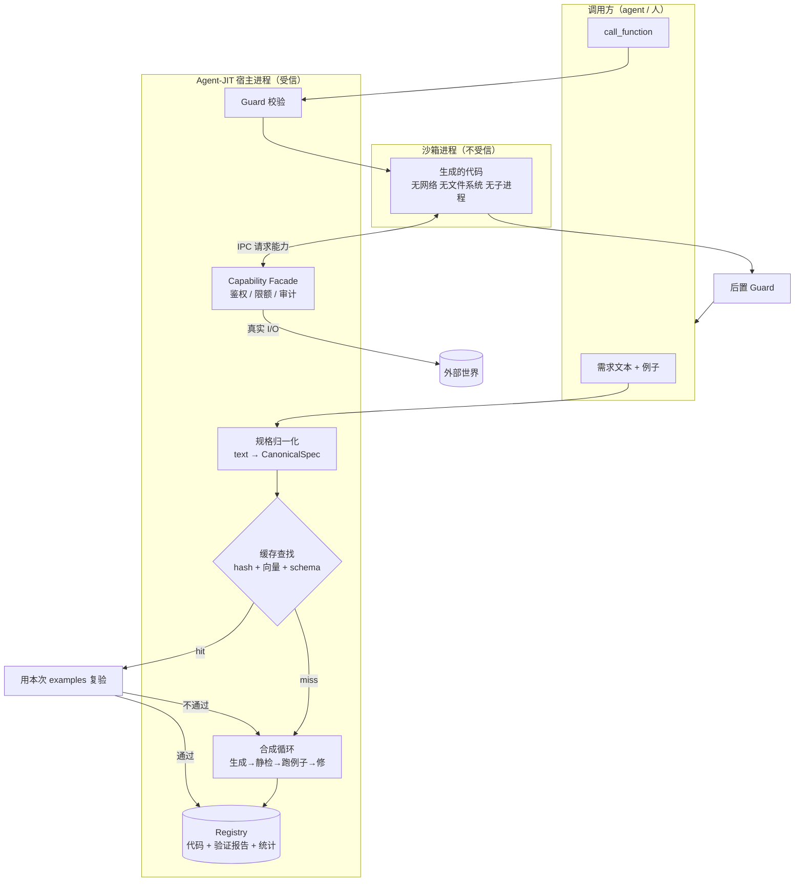

# Agent-JIT 设计文档

> 一个外挂组件：输入文本需求，长出代码，在沙箱里调用，返回结果，并缓存复用。

| 字段 | 值 |
| --- | --- |
| 状态 | Draft |
| 版本 | 0.2 |
| 日期 | 2026-09-16 |
| 变更 | v0.1 是 tracing JIT（自动挖掘热点）。v0.2 收窄为显式请求驱动，trace 机制移至 [tracing-frontend.md](tracing-frontend.md) 作为后续前端 |

---

## 1. 这是什么

一个独立进程，对外暴露四个操作。调用方（通常是 agent，也可以是人）不需要改造自己的执行循环。

```
compile_function(requirement, examples) → handle
call_function(handle, args)             → result
search_functions(query)                 → [handle...]
inspect_function(handle)                → 源码/统计/验证报告
```

典型用法：

```
Agent: 我要把 200 个 CSV 按同一套规则汇总。
  → compile_function("把 CSV 行按 type 分组求和，输出 {type: 总额}", examples=[...])
  ← handle "fn_7a3c"   （首次：合成 + 验证，花 ~20s / ~15k token）
  → call_function("fn_7a3c", {rows: [...]})  × 200
  ← 结果                （每次：~30ms / 0 token）
```

第 1 次比 agent 自己算贵，第 3 次开始净赚，第 200 次省下的是两个数量级。

**核心主张：agent 擅长的是"想清楚要做什么"，不是"做 200 遍"。把后者交给代码。**

---

## 2. 与 v0.1 的关系

| | v0.1 tracing JIT | v0.2 本设计 |
| --- | --- | --- |
| 编译触发 | 系统挖掘热点自动触发 | 调用方显式请求 |
| 编译输入 | N 条真实执行轨迹 | 一段文本 + 若干例子 |
| 正确性依据 | 轨迹回放（免费的测试集） | **调用方提供的例子**（§6.2） |
| 集成方式 | 深度嵌入 agent 执行循环 | 外挂，零侵入 |
| 最难的部分 | 轨迹挖掘与参数反推 | 无例子时的验证 |

v0.1 的轨迹机制不作废——它是本组件未来的**前端**：自动观察 agent 在重复做什么，替它把 `compile_function` 调掉。本文档描述的是后端，先把后端做对。

---

## 3. 目标与非目标

### 目标

- G1 **正确性可归因。** 每个缓存的函数都必须能回答"凭什么认为它是对的"。答不上来的不进缓存。
- G2 **零信任执行。** 生成的代码默认没有任何 I/O 能力，能力逐项显式授予。
- G3 **零侵入。** 任何 agent 不改代码就能用。
- G4 **复用可靠。** 缓存命中不能是"看起来像"，必须有结构性依据。
- G5 **失败是明确的错误，不是错误的结果。** 宁可返回 error 让调用方兜底。

### 非目标

- N1 不做通用编程助手。目标是**可复用的确定性函数**，不是"帮我写个项目"。
- N2 不自动执行破坏性操作（§7.3）。
- N3 首版不做跨用户共享缓存。
- N4 不替调用方决定"该不该编译"。触发判断留给调用方或未来的 tracing 前端。

---

## 4. 接口设计

这是产品面，其他都是实现细节。

### 4.1 `compile_function`

```jsonc
{
  "requirement": "把 CSV 行按 type 字段分组，对 amount 求和，返回 {type: 总额}。金额字段可能带货币符号和千分位逗号，要清洗。",

  "examples": [                       // 见 §6.2：这是规格，不是可选项
    { "input":  { "rows": [{"type":"refund","amount":"$1,200.50"},
                           {"type":"sale","amount":"$300"}] },
      "output": { "refund": 1200.50, "sale": 300.0 } }
  ],

  "capabilities": [],                 // 默认空 = 纯函数。见 §6.4
  "timeout_ms": 5000,
  "cache": "auto"                     // auto | force_new | ephemeral
}
```

返回：

```jsonc
{
  "handle": "fn_7a3c9e",
  "status": "ready",                  // ready | failed
  "cache": "miss",                    // hit | miss | reused_with_new_version
  "param_schema":  { /* 推断出来的 */ },
  "return_schema": { /* 推断出来的 */ },
  "verification": { "examples_passed": "3/3", "static_ok": true, "level": "VERIFIED" },
  "cost": { "tokens": 14200, "wall_ms": 19400, "attempts": 2 }
}
```

失败时返回 `status: "failed"` 加结构化诊断（哪个例子没过、期望什么、实际什么、最后一次 traceback）。**失败要让调用方看懂是自己需求写得不清楚，还是这事本来就不该用代码做。**

### 4.2 `call_function`

```jsonc
{ "handle": "fn_7a3c9e", "args": { "rows": [...] }, "timeout_ms": 5000 }
```

返回 `{ "ok": true, "result": {...}, "stats": {...} }`
或 `{ "ok": false, "error": { "kind": "guard_failed|runtime_error|budget_exceeded|...", ... } }`

**`call_function` 永远不抛给调用方一个"看起来成功但其实错了"的结果**——这是整个系统的第一性质。

### 4.3 `search_functions` / `inspect_function`

`search` 让调用方在写需求前先看看有没有现成的。`inspect` 返回源码、验证报告、运行统计，供人审阅和调试。

### 4.4 交付形态

**MCP server。** 理由：这就是"外挂"的标准答案——任何 MCP 客户端零改造接入，能力边界由 MCP 的权限机制天然托管，进程隔离是现成的。同时提供 Python 库形态，供不走 MCP 的宿主直接嵌入。

---

## 5. 架构



关键结构：**生成的代码在沙箱里一点 I/O 能力都没有。** 它要做任何外部操作，只能通过 IPC 向宿主的 Facade 提出请求，宿主鉴权、限额、审计之后代执行。见 §7.2。

---

## 6. 核心机制

### 6.1 规格归一化：缓存的 key 不是原文

同一件事有一万种说法。直接拿需求文本做 key，缓存命中率会低到没意义。

```python
CanonicalSpec = {
    "intent":        "按分类字段分组对数值字段求和",   # 归一化的一句话
    "param_schema":  {...},    # 从 examples 的 input 推断
    "return_schema": {...},    # 从 examples 的 output 推断
    "capabilities":  [],
    "effect_class":  "PURE",
}
spec_hash = sha256(canonical_json(intent_normalized, param_schema, return_schema, capabilities))
```

查找三级，**越往下越不可信，所以越往下验证越重**：

| 级别 | 手段 | 命中后动作 |
| --- | --- | --- |
| L1 | `spec_hash` 精确匹配 | 直接用 |
| L2 | `intent` 向量近邻 → **schema 结构兼容性过滤** | 必须过 §6.2 复验 |
| L3 | 无命中 | 走合成 |

L2 的向量匹配单独用是危险的——"求和"和"求平均"在嵌入空间里挨得很近。所以向量只用来**缩小候选集**，真正的判定靠两道结构性关卡：入参/返回 schema 必须兼容，以及下面这条。

### 6.2 例子即规格 —— 本设计的核心主张

> 完整展开见 **[correctness.md](correctness.md)**。这里只讲结论。

v0.1 里正确性是免费的：轨迹本身就是测试用例。现在没有轨迹了，这个缺口必须补，而且不能靠"让模型自己写测试"——**模型误解了需求，它写的代码和它写的测试会基于同一个误解，一起通过，交付一个自洽的错误。** 你没法从一个模型自己的理解里 bootstrap 出正确性。

所以判据必须来自模型理解之外。硬规则：

> **拿不出验收判据的合成产物不进持久缓存。**
> 有判据 → `VERIFIED`，可缓存、可复用。
> 没有 → `EPHEMERAL`，只执行这一次，用完即弃。

**判据有两条等价入口**（[correctness.md §11](correctness.md#11-验证等级门槛)）：

| 入口 | 调用方要做什么 | 适用 |
| --- | --- | --- |
| **给例子** | 提供 ≥2 组输入/输出，含 ≥1 边界 | 调用方清楚自己要什么 |
| **做裁决** | 回答几个单选题（§差分测试发现的歧义点） | 调用方说不清，但能认出对错 |

第二条入口是对"调用方不给例子怎么办"的正面回答——**不要让调用方出题，让调用方裁决。** 独立合成 3 份实现，它们分歧的地方精确指出了需求里没说清的部分，把它变成一道单选题（"金额为负时：保留 / 归零 / 报错？"），回答即成为一个正中要害的测试用例。对调用方几秒钟的事，产出的用例质量比凭空出题高得多。

例子这条入口还顺带解决三件事：

1. **消歧** — 两个例子比两段补充说明更能讲清需求。`amount` 可能是 `"$1,200.50"` 这种事，写在例子里一目了然，写在散文里模型会漏。
2. **schema 推断** — 参数和返回结构直接从例子结构读出来，不用猜。
3. **缓存命中的验收** — 这条最妙：**L2 语义命中的候选，用本次请求的例子跑一遍就知道能不能用。** 跑不过 = 不是同一个函数，视为 miss 去合成新版本。等于在每个复用点上免费架了道 guard，用的还是本次调用方自己的标准。

但要清楚例子的**天花板**：调用方最多给两三个，只锚定了输入空间里的两三个点。覆盖靠另外两样东西——**变形性质**（"打乱行序结果不变"这类不知道答案也能检查的约束，一条抵一万个用例）和**模糊测试**。这两样都不需要标准答案，成本也低到没理由不开。见 [correctness.md §4](correctness.md#4-t2--变形性质一条性质抵一万个用例)。

### 6.3 合成循环

```python
def synthesize(spec, examples, tools) -> Result:
    feedback = None
    for attempt in range(1, MAX_ATTEMPTS + 1):        # MAX_ATTEMPTS = 3
        code = llm_generate(spec, tools, feedback)

        ok, why = static_check(code)                   # §7.1，不过直接重来，不浪费一次执行
        if not ok:
            feedback = StaticFailure(why); continue

        r = sandbox_run_all(code, examples)
        if r.all_passed:
            return Success(code, r)

        feedback = ExampleFailure(                     # 结构化，不是"再试一次"
            example_index = r.first_fail.idx,
            input         = r.first_fail.input,
            expected      = r.first_fail.expected,
            actual        = r.first_fail.actual,
            traceback     = r.first_fail.tb,
        )
    return Failure(attempts=MAX_ATTEMPTS, last=feedback)
```

两个要点：

- **反馈必须结构化。** "第 2 个例子期望 `{"sale": 300.0}` 实际 `{"sale": "300"}`" 能让模型一次修对；"没通过，再试试"只会让它随机重写。
- **修复循环只能看到一部分用例。** 30%（至少 1 个）留作 hold-out，修复循环完全看不到，最后验收时才跑。跑 3 轮反馈之后，模型完全可能写出一份只对可见用例正确的代码——极端情况是 `if input == X: return Y`。**Hold-out 挂了不是再修一轮**（那只会让过拟合更深），而是允许一次保留集轮换，再挂即判失败。见 [correctness.md §9](correctness.md#9-防过拟合模型会对着测试集写代码)。
- **三次不过就停。** 反复重试的边际收益掉得很快，而且失败本身是有信息的——它通常说明这事不适合用代码做（需要判断、需求本身矛盾、例子之间不自洽）。把这个信号如实报给调用方，比默默烧掉 60k token 再交付一个勉强通过的产物有用。

留一条出口：`EPHEMERAL` 模式下，如果三次不过，可以降级成"把最后一版代码和失败详情一起返回"，让 agent 自己决定要不要用。但不进缓存。

### 6.4 能力注入：默认纯函数

生成的代码看到的整个世界就是一个 `ctx`：

```python
def solve(params: dict, ctx: Ctx) -> dict:
    ...

class Ctx:
    http:  HttpFacade  | None    # 仅当 capability 含 net:<域名白名单>
    fs:    FsFacade    | None    # 仅当 capability 含 fs:<路径白名单>
    tools: ToolFacade  | None    # 宿主 agent 的 tool，仅白名单内
    llm:   LlmFacade   | None    # 固定模板 + 强制输出 schema
    log:   Logger                # 永远有
```

**默认全是 `None`。** 纯函数不需要任何能力，而纯函数覆盖的场景比直觉中多得多：解析、清洗、转换、聚合、格式化、计算、校验、diff、模板渲染。这些恰好是 agent 做起来最贵（token 多、易飘）而代码做起来最便宜的事。

需要 I/O 时逐项声明，宿主逐项批准，写进该函数的 `CapabilitySet` 并在每次调用时强制执行。

`llm` facade 值得单独说：它让生成的代码里可以保留"需要判断"的槽位（分类、摘要、抽取），但被限制成固定模板 + 强制 schema。这样一个 10 步的任务里，8 步机械的变成代码，2 步判断的变成受控模型调用——收益依然巨大，而且可控性远高于自由推理。**不要因为"有一步需要模型判断"就放弃编译整个函数。**

### 6.5 缓存、版本与失效

- 一个 `spec_hash` 下可以有多个版本。L2 命中复验不过时新增版本而非覆盖——不同调用方对"同一件事"的期望可能真的不同。
- 版本按 `(验证等级, 复验通过次数, 最近 guard 失败率)` 排序，查找时取最优。
- **失效**：连续 3 次 guard 失败 → 该版本 `QUARANTINED`，下次请求重新合成。
- **清理**：90 天零命中的函数自动下线。缓存腐化比缓存未命中更伤——一堆半废的函数会把 L2 的候选集污染掉。

---

## 7. 沙箱与安全

生成的代码在你的机器上执行，这是设计上的任意代码执行。安全不是附加项。

### 7.1 静态检查（第一道）

AST 白名单，不通过直接拒绝、不进沙箱：

- 禁 `import`（允许的标准库子集由 runtime 预注入到命名空间）
- 禁 `eval` / `exec` / `compile` / `__import__`
- 禁 `__` 开头的属性访问（挡掉 `__builtins__` / `__globals__` 那一整类逃逸）
- 禁文件、网络、子进程原语
- 禁疑似凭据的字面量（正则 + 熵检测）——**硬性拒绝**，凭据只能由 facade 运行时注入

静态检查便宜，放在最前面，还能省下一次沙箱执行。

### 7.2 Facade RPC：沙箱里不开洞

这是安全模型里最重要的一个结构决策。

常见做法是"在沙箱里开个口子让代码能联网"。问题是沙箱的强度取决于这个口子的实现质量，而口子会越开越多。

改成反过来：**沙箱里一个洞都不开。** 网络命名空间为空、文件系统只读且只挂 runtime、无子进程、rlimit 卡死 CPU/内存/时间。代码要做任何外部操作，只能通过 stdin/stdout 上的 IPC 协议向宿主提出请求：

```
sandbox → host:  {"op":"http.get", "url":"https://api.example.com/v2/x"}
host:            鉴权（域名在白名单吗）→ 限额（这次调用第几次了）→ 审计日志 → 代执行
host → sandbox:  {"ok":true, "status":200, "body":"..."}
```

三个好处：沙箱配置退化成"禁掉一切"这种不会写错的简单事；能力控制集中在宿主侧一处，可审计可限额；facade 调用天然是 mock 点，验证和回放都直接受益。

### 7.3 副作用分级

| 等级 | 含义 | 自动编译 | 自动执行 |
| --- | --- | --- | --- |
| `PURE` | 纯计算 | ✅ | ✅ |
| `READ_ONLY` | 只读外部状态 | ✅ | ✅ |
| `IDEMPOTENT_WRITE` | 幂等写 | ✅ | ✅ |
| `NON_IDEMPOTENT_WRITE` | 追加、计数、创建 | ✅ | ❌ 需确认 |
| `DESTRUCTIVE` | 删除、付款、对外发送 | ❌ | ❌ |

`DESTRUCTIVE` 不自动编译的理由不是技术难度，是**错误代价与兜底机制不匹配**：本系统出错时的兜底是"返回 error，调用方重做"，而删除和转账重做不了。

### 7.4 需求文本与例子是不可信输入

需求可能来自用户，也可能是 agent 从它读到的网页、文件、API 响应里转述的。这些内容会进入合成 prompt。

- 合成 prompt 里，需求和例子放在明确定界的数据区，声明为不可信数据而非指令。
- 生成代码里出现的硬编码 URL、路径、shell 命令，全部进人工审阅清单。一个"给 CSV 分组求和"的函数不应该凭空长出一个外部端点。
- 即使注入成功让模型写出了恶意代码，静态检查和空洞沙箱是第二、三道防线。**单层防御在这里是不够的。**

### 7.5 资源预算

每次 `call_function` 硬上限：墙钟时间、内存、facade 调用次数、输出大小。超限立即杀进程并返回 `budget_exceeded`。防的是失控循环和生成代码里的意外递归。

---

## 8. 验证与 Guard

### 8.1 验证等级

门槛的完整定义在 [correctness.md §11](correctness.md#11-验证等级门槛)。摘要：

| 等级 | 条件 | 可缓存 | 可复用 |
| --- | --- | --- | --- |
| `EPHEMERAL` | 拿不出验收判据 | ❌ | ❌ |
| `VERIFIED` | 静态检查 + 例子（或差分裁决）全过 + 模糊测试全过<br>+ **分支覆盖 100%** + **变异得分 ≥80%** + hold-out 通过 | ✅ | ✅ |
| `CONFIRMED` | `VERIFIED` + 调用方确认的变形性质 ≥1 条（+ 可选影子执行） | ✅ | ✅ 优先 |
| `QUARANTINED` | 曾 `VERIFIED`，运行时连续失败 3 次 | 保留 | ❌ |

两条关卡值得单独点名，因为它们回答的是"跑过了能说明什么"——这个问题和"用例从哪来"同等重要，但更容易被忽略：

- **分支覆盖 100%** — 未覆盖的分支就是未验证的代码。有未覆盖分支时**优先让模型删掉它**（生成代码里充满无用的防御性分支），删不掉再补用例。代码越小，要验证的面越小。
- **变异得分 ≥80%** — 故意把代码改坏，看测试集抓不抓得住。这是唯一不需要标准答案还能量化"测试集强度"的手段。变异测试在正常工程里太慢没人用，**但这里的函数是 20 行的纯函数，50 个变异体跑完只要 250ms**——这是纯函数设计的意外红利，没有理由不开。

**除差分和影子外的全套验证 2 秒内跑完且不花 token**，而合成本身要十几秒和上万 token。验证在成本结构里几乎是免费的，不该省。

### 8.2 Guard

Guard 必须比它保护的代码便宜得多，否则失去意义。

| Guard | 时机 | 成本 | 失败动作 |
| --- | --- | --- | --- |
| 入参 schema | 调用前 | 微秒 | `guard_failed` |
| capability 可用性 | 调用前 | 微秒 | `guard_failed` |
| 资源预算 | 执行中 | 持续 | 杀进程，`budget_exceeded` |
| 返回 schema | 调用后 | 微秒 | `postcondition_failed` |
| 后置断言 | 调用后 | 毫秒 | `postcondition_failed` |

后置断言从需求和例子里自动提炼（"返回的 key 集合 ⊆ 输入里出现过的 type"这类结构性质），也接受调用方显式指定。

### 8.3 失败就是失败

外挂形态下，本组件不知道调用方"本来会怎么做这件事"，所以**不做 v0.1 那种自动回退**。guard 失败就返回结构化 error，由 agent 决定是自己上手还是换个路子。

提供一个可选开关 `on_fail: "recompile"`：自动触发一次重新合成后重试一次。默认关，因为它会把一次失败的延迟放大到几十秒——是否值得只有调用方知道。

---

## 9. 指标

**收益**
- `cache_hit_rate` — 缓存命中率。低于 30% 说明规格归一化没做好，或者场景本身重复度不够
- `net_savings` — 累计节省 − 累计合成成本。**转正之前系统是净亏的**
- `amortization_point` — 一个函数平均调用几次回本。目标 < 5

**健康**
- `synth_success_rate` — 3 次尝试内通过全部验证关卡的比例。目标 > 60%
- `mutation_score` / `branch_coverage` — 测试集强度，不是代码质量。持续偏低说明判据太弱，`VERIFIED` 是虚的
- `holdout_fail_rate` — hold-out 挂掉的比例。偏高说明修复循环在过拟合
- `l2_reverify_pass_rate` — 语义命中后复验通过率。持续偏低说明向量匹配放得太宽
- `guard_failure_rate` — 目标 < 2%

**正确性（一票否决）**
- `silent_divergence` — 返回了成功但结果是错的次数。**目标 0，任何非零立即隔离该函数并复盘。**
- 每次 `silent_divergence` 都必须产出一个新回归用例。抓到一次却没让测试集变厚，等于白抓。

---

## 10. 路线图

| 阶段 | 内容 | 出口判据 |
| --- | --- | --- |
| **M0 — 能跑通**<br>*代码已完成，待真实验证* | ~~纯函数沙箱 + 静态检查~~；~~hold-out~~；~~模糊 + 分支覆盖 + 变异测试~~；~~schema 推断~~；~~合成循环 + 结构化反馈~~；~~缓存~~ | ✅ 11 个语料用例，每道关卡都抓住了它该抓的东西，且在正确实现上不误报<br>✅ 合成循环全流程由回放脚本覆盖（保留集不泄漏、三次即停、变异失败归因到用例）<br>✅ `compile → 入库 → call 200 次 → 打印 net_savings` 全程有测试覆盖<br>⬜ **用真实模型合成出一个正确函数** —— 凭据过期，尚未跑通 |
| **M1 — 能复用** | 规格归一化；三级查找 + L2 复验；~~持久化 Registry（**以测试集为中心**）~~；变形性质（挖 + 警告已有，缺确认流）；差分测试 + 裁决流；~~验证等级~~；~~`inspect`~~ / `search` | 换一种说法描述同一需求能命中缓存；差分裁决能在不给例子的情况下产出 `VERIFIED` 函数；`net_savings` 在**一次真实合成**的成本上转正 |
| **M2 — 能信任** | 完整 Guard（入参/返回 schema + 后置断言已有，缺 capability 与预算）；资源预算；~~QUARANTINE 与失效~~；MCP server 形态；审计日志 | 接进真实 agent 跑一个批处理任务，`silent_divergence` = 0 |
| **M3 — 能做事** | Capability facade（http / fs / tools / llm）；副作用分级；人工确认流 | 合成出一个带受控 I/O 的函数并安全执行 |
| **M4 — 能自动** | 接入 [tracing 前端](tracing-frontend.md)，自动发现重复并替调用方触发 compile | 无人干预下自动产出可用函数 |

M0/M1 是立项验证：**如果人工写一个需求都换不来正向收益，自动化只会放大亏损。**

---

## 11. 风险与开放问题

### 风险

| 风险 | 缓解 |
| --- | --- |
| **静默错误**——返回成功但结果错 | 例子验证 + L2 复验 + 后置 guard + `silent_divergence` 一票否决 |
| **对测试集过拟合**——代码只在见过的用例上对 | Hold-out 分割（修复循环看不到 30%）+ 禁止硬编码答案 + 测试先行 + 变异得分门槛 |
| **测试集太弱**——全过了但什么都没验到 | 分支覆盖 100% + 变异得分 ≥80%，两者都不需要标准答案 |
| **生成输入 ≠ 真实分布**——性质/模糊/差分全在生成输入上跑 | 影子执行是唯一对冲，但最贵；生产 guard 失败输入持续回灌测试集 |
| **L2 误命中**——拿到"看起来像"的函数 | schema 结构兼容 + 例子复验双关卡；复验不过即新增版本 |
| **合成成本吃掉收益** | `net_savings` / `amortization_point` 作为一级指标；三次不过即停 |
| **prompt 注入经由需求文本** | 数据/指令分离 + AST 白名单 + 空洞沙箱 + 新增外部端点人工审阅 |
| **缓存腐化** | 零命中自动下线；QUARANTINE 不参与 L2 候选 |

### 开放问题

1. **两条判据入口哪条是主路径？** 例子入口依赖调用方主动出题，裁决入口依赖调用方愿意被打断。两者都有摩擦，只是形式不同。**M0 最该先测的就是这件事**——真实用起来 agent 更愿意出题还是更愿意裁决，而不是等 M2 才发现 `EPHEMERAL` 成了主路径。
2. **谁来决定"这事该编译"？** MVP 靠 prompt 指引 agent 自己判断，不可靠。这正是 tracing 前端的价值所在，但 M0–M3 期间需要一个能用的经验法则。
3. **沙箱方案的最终选型。** 子进程 + seccomp 够 M0/M1；跑不可信来源或长驻服务时是否要上容器 / microVM / WASM？接口要设计成后端可替换，但默认选哪个需要按实际威胁模型定。
4. **`llm` facade 的输出怎么 guard？** 槽位输出目前只受 schema 约束，schema 合法但语义错误拦不住。是否需要针对槽位做单独的一致性检查？
5. **函数粒度。** 编得太粗复用率低，太细收益小。是否需要自动的拆分/合并？
6. **跨用户复用的数据边界。** 复用价值主要在跨用户，但函数里可能编进了某个用户的目录结构或业务假设。首版限定单用户，这块要单独设计。

---

## 附录 A：一次完整调用

**需求**：把 200 个月度 CSV 按 type 分组求和。

```
compile_function(
  requirement = "把 CSV 行按 type 分组，对 amount 求和，返回 {type: 总额}。
                 amount 可能带货币符号和千分位逗号。空 amount 按 0 算。",
  examples = [
    { input:  { rows: [{type:"refund", amount:"$1,200.50"}, {type:"sale", amount:"$300"}] },
      output: { refund: 1200.50, sale: 300.0 } },
    { input:  { rows: [] },                          output: {} },        // 边界
    { input:  { rows: [{type:"sale", amount:""}] },  output: { sale: 0.0 } } // 边界
  ]
)
```

**归一化** → `intent: "按分类字段分组对数值字段求和"`，`param_schema` / `return_schema` 从例子推断，`effect_class: PURE`，`capabilities: []`

**查找** → L1 miss，L2 找到一个候选（"按类别汇总金额"），schema 兼容 → 跑本次 3 个例子 → 第 3 个挂了（那个函数把空 amount 当成跳过，本次期望算 0）→ **视为 miss，走合成，新增版本**

**合成** → 第 1 次：静态检查挂（用了 `re` 但 runtime 没预注入）→ 结构化反馈 → 第 2 次：3/3 通过

**产物**：

```python
def solve(params, ctx):
    out = {}
    for row in params["rows"]:
        raw = (row.get("amount") or "").strip()
        cleaned = "".join(c for c in raw if c.isdigit() or c in ".-")
        out[row["type"]] = out.get(row["type"], 0.0) + (float(cleaned) if cleaned else 0.0)
    return out
```

**Guards**：入参 schema（`rows` 是数组，元素含 `type`）/ 返回 schema（值全是 number）/ 后置断言（返回的 key 集合 ⊆ 输入里出现过的 type）

**验证**：`VERIFIED`，3/3

**收益**：合成花 14.2k token / 19.4s。之后 200 次调用，每次 ~30ms / 0 token。对照 agent 自己逐个处理约 2.5k token / 4s 一次——**第 6 次回本，200 次省下约 486k token 和 13 分钟。**
