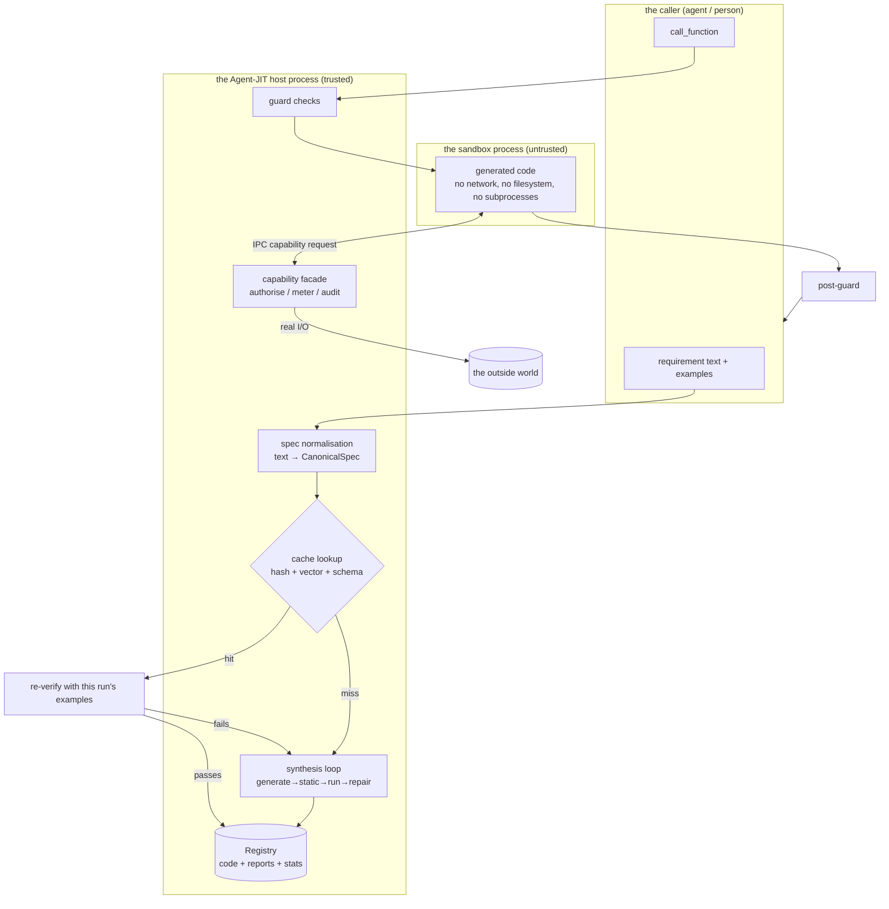

# Agent-JIT design document

> A bolt-on component: a text requirement goes in, code comes out, it is called in a
> sandbox, the result comes back, and it is cached for reuse.

| Field | Value |
| --- | --- |
| Status | Draft |
| Version | 0.2 |
| Date | 2026-09-16 |
| Change | v0.1 was a tracing JIT (mining hotspots automatically). v0.2 narrows to explicit request-driven compilation; the trace machinery moved to [tracing-frontend.md](tracing-frontend.md) as a later front end |

---

## 1. What this is

A separate process exposing four operations. The caller (usually an agent, possibly a
person) does not have to change its own execution loop.

```
compile_function(requirement, examples) → handle
call_function(handle, args)             → result
search_functions(query)                 → [handle...]
inspect_function(handle)                → source / statistics / verification report
```

The typical use:

```
Agent: I need to summarise 200 CSVs by the same set of rules.
  → compile_function("group CSV rows by type and sum them, output {type: total}", examples=[...])
  ← handle "fn_7a3c"   (first time: synthesise and verify, ~20s / ~15k tokens)
  → call_function("fn_7a3c", {rows: [...]})  × 200
  ← results            (each: ~30ms / 0 tokens)
```

The first call costs more than the agent doing it itself; from the third it is net
positive; by the two hundredth it has saved two orders of magnitude.

**The core claim: what an agent is good at is working out what to do, not doing it two
hundred times. Hand the second part to code.**

---

## 2. Relationship to v0.1

| | v0.1 tracing JIT | v0.2, this design |
| --- | --- | --- |
| Compilation trigger | the system mines hotspots and triggers automatically | the caller asks explicitly |
| Compilation input | N real execution traces | a paragraph of text plus some examples |
| Basis for correctness | trace replay (a free test set) | **examples the caller supplies** (§6.2) |
| Integration | deeply embedded in the agent's execution loop | bolt-on, zero intrusion |
| The hard part | mining traces and recovering parameters | verification when there are no examples |

v0.1's trace machinery is not discarded — it is this component's future **front end**:
watch what the agent keeps repeating and call `compile_function` on its behalf. This
document describes the back end. Get the back end right first.

---

## 3. Goals and non-goals

### Goals

- G1 **Correctness is attributable.** Every cached function must be able to answer "on
  what grounds do you believe this is correct?". Anything that cannot answer does not get
  cached.
- G2 **Zero-trust execution.** Generated code has no I/O capability by default;
  capabilities are granted one at a time, explicitly.
- G3 **Zero intrusion.** Any agent can use it without changing its code.
- G4 **Reuse is reliable.** A cache hit must not be "looks similar"; it must rest on
  something structural.
- G5 **A failure is a clear error, not a wrong result.** Better to return an error and let
  the caller handle it.

### Non-goals

- N1 Not a general-purpose coding assistant. The target is **reusable deterministic
  functions**, not "write me a project".
- N2 No automatic destructive operations (§7.3).
- N3 No cross-user shared cache in the first version.
- N4 It does not decide for the caller whether something should be compiled. That
  judgement belongs to the caller, or to the future tracing front end.

---

## 4. Interface design

This is the product surface. Everything else is an implementation detail.

### 4.1 `compile_function`

```jsonc
{
  "requirement": "Group CSV rows by the type field and sum the amount, returning {type: total}. The amount may carry a currency symbol and thousands separators, so clean it.",

  "examples": [                       // see §6.2: this is the spec, not an optional extra
    { "input":  { "rows": [{"type":"refund","amount":"$1,200.50"},
                           {"type":"sale","amount":"$300"}] },
      "output": { "refund": 1200.50, "sale": 300.0 } }
  ],

  "capabilities": [],                 // empty by default = a pure function. See §6.4
  "timeout_ms": 5000,
  "cache": "auto"                     // auto | force_new | ephemeral
}
```

Returns:

```jsonc
{
  "handle": "fn_7a3c9e",
  "status": "ready",                  // ready | failed
  "cache": "miss",                    // hit | miss | reused_with_new_version
  "param_schema":  { /* inferred */ },
  "return_schema": { /* inferred */ },
  "verification": { "examples_passed": "3/3", "static_ok": true, "level": "VERIFIED" },
  "cost": { "tokens": 14200, "wall_ms": 19400, "attempts": 2 }
}
```

On failure it returns `status: "failed"` plus a structured diagnosis (which example
failed, what was expected, what came back, the last traceback). **A failure has to let the
caller see whether their requirement was unclear or whether this was never a job for
code.**

### 4.2 `call_function`

```jsonc
{ "handle": "fn_7a3c9e", "args": { "rows": [...] }, "timeout_ms": 5000 }
```

Returns `{ "ok": true, "result": {...}, "stats": {...} }`
or `{ "ok": false, "error": { "kind": "guard_failed|runtime_error|budget_exceeded|...", ... } }`

**`call_function` never hands the caller a result that looks like a success but is
wrong** — that is the first property of the whole system.

### 4.3 `search_functions` / `inspect_function`

`search` lets a caller check whether something already exists before writing a
requirement. `inspect` returns the source, the verification report and runtime statistics,
for review and debugging.

### 4.4 Delivery form

**An MCP server.** The reasoning: that is the standard answer for a bolt-on — any MCP
client connects with no changes, the capability boundary is naturally carried by MCP's
permission machinery, and process isolation comes for free. A Python library form is
offered alongside it for hosts that do not go through MCP.

---

## 5. Architecture



The key structure: **generated code has no I/O capability whatsoever inside the sandbox.**
To do anything external it must raise a request over IPC to the host's facade, which
authorises, meters and audits it, then performs it on the code's behalf. See §7.2.

---

## 6. Core mechanisms

### 6.1 Spec normalisation: the cache key is not the text

There are ten thousand ways to say the same thing. Using the requirement text directly as
a key drives the hit rate down to the point of meaninglessness.

```python
CanonicalSpec = {
    "intent":        "group by a categorical field and sum a numeric field",  # normalised
    "param_schema":  {...},    # inferred from the examples' inputs
    "return_schema": {...},    # inferred from the examples' outputs
    "capabilities":  [],
    "effect_class":  "PURE",
}
spec_hash = sha256(canonical_json(intent_normalized, param_schema, return_schema, capabilities))
```

Lookup has three levels, and **the further down you go the less trustworthy it is, so the
further down you go the heavier the verification**:

| Level | Means | Action on a hit |
| --- | --- | --- |
| L1 | exact `spec_hash` match | use it directly |
| L2 | `intent` vector nearest-neighbour → **schema compatibility filter** | must pass the §6.2 re-verification |
| L3 | no hit | go and synthesise |

L2's vector match is dangerous on its own — "sum" and "average" sit very close together in
embedding space. So the vector is used only to **narrow the candidate set**; the actual
decision rests on two structural gates: the param and return schemas must be compatible,
and then the following.

### 6.2 Examples are the spec — the core claim of this design

> Fully developed in **[correctness.md](correctness.md)**. Only the conclusion here.

In v0.1 correctness was free: a trace is a test case. Without traces that gap has to be
filled, and it cannot be filled by "let the model write its own tests" — **the model
misreads the requirement, the code it writes and the tests it writes rest on the same
misreading, they pass together, and a self-consistent wrong answer is delivered.** You
cannot bootstrap correctness out of a model's own understanding.

So the criterion has to come from outside the model's understanding. The hard rule:

> **A synthesis result with no acceptance criterion does not enter the persistent cache.**
> With a criterion → `VERIFIED`: cacheable, reusable.
> Without → `EPHEMERAL`: executed once and thrown away.

**There are two equivalent entry points to a criterion**
([correctness.md §11](correctness.md)):

| Entry point | What the caller does | When it fits |
| --- | --- | --- |
| **give examples** | supply ≥2 input/output pairs, ≥1 of them a boundary | the caller knows what they want |
| **adjudicate** | answer a few multiple-choice questions (the ambiguities differential testing found) | the caller cannot articulate it but can recognise right from wrong |

The second entry point is the direct answer to "what if the caller gives no examples" —
**do not ask the caller to set the questions, ask the caller to adjudicate.** Synthesise 3
implementations independently; where they disagree is precisely what the requirement left
unsaid. Turn that into a multiple-choice question ("negative amount: keep / zero / raise?")
and the answer becomes a test case that lands on the sore spot. Seconds of work for the
caller, and far higher quality than a case they invented.

The examples entry point also solves three things along the way:

1. **Disambiguation** — two examples say more than two paragraphs of clarification. That
   `amount` can be `"$1,200.50"` is obvious in an example and easy for the model to miss
   in prose.
2. **Schema inference** — the parameter and return shapes are read straight off the
   examples, not guessed.
3. **Acceptance for a cache hit** — the neat one: **an L2 semantic candidate can be tested
   simply by running this request's examples against it.** Failing means it is not the
   same function, so treat it as a miss and synthesise a new version. That is a free guard
   at every reuse point, using the current caller's own standard.

But be clear about the **ceiling** on examples: a caller will give two or three at most,
anchoring two or three points in the input space. Coverage comes from two other things —
**metamorphic properties** (constraints like "shuffling the rows does not change the
result", checkable without knowing the answer, one worth ten thousand cases) and **fuzz
testing**. Neither needs an answer key and both are cheap enough that there is no reason
not to run them. See [correctness.md §4](correctness.md).

### 6.3 The synthesis loop

```python
def synthesize(spec, examples, tools) -> Result:
    feedback = None
    for attempt in range(1, MAX_ATTEMPTS + 1):        # MAX_ATTEMPTS = 3
        code = llm_generate(spec, tools, feedback)

        ok, why = static_check(code)                   # §7.1; a failure restarts without
        if not ok:                                     # wasting an execution
            feedback = StaticFailure(why); continue

        r = sandbox_run_all(code, examples)
        if r.all_passed:
            return Success(code, r)

        feedback = ExampleFailure(                     # structured, not "try again"
            example_index = r.first_fail.idx,
            input         = r.first_fail.input,
            expected      = r.first_fail.expected,
            actual        = r.first_fail.actual,
            traceback     = r.first_fail.tb,
        )
    return Failure(attempts=MAX_ATTEMPTS, last=feedback)
```

Three points:

- **The feedback has to be structured.** "Example 2 expected `{"sale": 300.0}`, got
  `{"sale": "300"}`" lets the model fix it in one go; "it failed, try again" only makes it
  rewrite at random.
- **The repair loop sees only part of the case set.** 30% (at least one) is held out,
  entirely invisible to the repair loop, and run only at final acceptance. After three
  rounds of feedback the model may well have written code that is only correct on the
  visible cases — in the extreme, `if input == X: return Y`. **A hold-out failure is not
  one more repair round** (that only deepens the overfitting); allow one rotation of the
  held-out subset, and a second failure means failure. See
  [correctness.md §9](correctness.md).
- **Stop after three.** The marginal return on retrying falls away fast, and the failure
  itself carries information — it usually means this is not a job for code (it needs
  judgement, the requirement contradicts itself, the examples are inconsistent with each
  other). Reporting that signal honestly to the caller is more useful than quietly burning
  60k tokens and delivering something that barely passes.

Leave one exit: in `EPHEMERAL` mode, three failures may degrade to "return the last
version of the code together with the failure details" and let the agent decide whether to
use it. It still does not get cached.

### 6.4 Capability injection: a pure function by default

The entire world the generated code sees is one `ctx`:

```python
def solve(params: dict, ctx: Ctx) -> dict:
    ...

class Ctx:
    http:  HttpFacade  | None    # only when the capabilities include net:<domain allowlist>
    fs:    FsFacade    | None    # only when the capabilities include fs:<path allowlist>
    tools: ToolFacade  | None    # the host agent's tools, allowlisted
    llm:   LlmFacade   | None    # a fixed template plus an enforced output schema
    log:   Logger                # always present
```

**All `None` by default.** A pure function needs no capabilities, and pure functions cover
far more ground than intuition suggests: parsing, cleaning, transforming, aggregating,
formatting, computing, validating, diffing, template rendering. These happen to be exactly
what an agent finds most expensive (many tokens, easy to drift) and what code finds
cheapest.

When I/O is needed it is declared item by item, approved item by item by the host, written
into that function's `CapabilitySet`, and enforced on every call.

The `llm` facade deserves its own note: it lets generated code keep a slot for the parts
that need judgement (classification, summarisation, extraction), constrained to a fixed
template plus an enforced schema. So in a ten-step task, the eight mechanical steps become
code and the two judgement steps become controlled model calls — the return is still large
and the controllability is far better than free-form reasoning. **Do not give up on
compiling a whole function just because one step needs a model's judgement.**

### 6.5 Caching, versions and invalidation

- One `spec_hash` can hold several versions. When an L2 hit fails re-verification, add a
  version rather than overwrite — two callers' expectations of "the same thing" may
  genuinely differ.
- Versions are ranked by (verification level, times re-verified, recent guard failure
  rate), and lookup takes the best.
- **Invalidation**: 3 consecutive guard failures → that version is `QUARANTINED` and the
  next request re-synthesises.
- **Cleanup**: a function with no hits for 90 days is retired automatically. Cache rot
  hurts more than a cache miss — a pile of half-dead functions pollutes L2's candidate set.

---

## 7. Sandboxing and security

Generated code executes on your machine. That is arbitrary code execution by design.
Security is not an add-on.

### 7.1 The static check (first gate)

An AST allowlist; anything that fails is rejected outright and never reaches the sandbox:

- no `import` (the allowed subset of the standard library is pre-injected into the
  namespace by the runtime)
- no `eval` / `exec` / `compile` / `__import__`
- no attribute access starting with `__` (blocking the whole `__builtins__` /
  `__globals__` class of escapes)
- no file, network or subprocess primitives
- no literals that look like credentials (regex plus entropy) — a **hard reject**;
  credentials may only be injected by the facade at runtime

The static check is cheap, goes first, and saves a sandbox execution as a side effect.

### 7.2 Facade RPC: no holes in the sandbox

This is the most important structural decision in the security model.

The usual approach is "cut a hole in the sandbox so the code can reach the network". The
problem is that the strength of the sandbox then depends on how well that hole was cut,
and holes only ever multiply.

Do the opposite: **cut no holes at all.** An empty network namespace, a read-only
filesystem with only the runtime mounted, no subprocesses, and rlimits pinning CPU, memory
and time. To do anything external, the code must raise a request to the host over an IPC
protocol on stdin/stdout:

```
sandbox → host:  {"op":"http.get", "url":"https://api.example.com/v2/x"}
host:            authorise (is the domain allowlisted) → meter (which call is this)
                 → audit log → perform it
host → sandbox:  {"ok":true, "status":200, "body":"..."}
```

Three benefits: the sandbox configuration degenerates into "deny everything", which is
hard to get wrong; capability control sits in one place on the host side, auditable and
meterable; and a facade call is a natural mock point, from which verification and replay
both benefit directly.

### 7.3 Effect classes

| Class | Meaning | Auto-compile | Auto-execute |
| --- | --- | --- | --- |
| `PURE` | pure computation | ✅ | ✅ |
| `READ_ONLY` | reads external state | ✅ | ✅ |
| `IDEMPOTENT_WRITE` | idempotent writes | ✅ | ✅ |
| `NON_IDEMPOTENT_WRITE` | appends, counters, creation | ✅ | ❌ needs confirmation |
| `DESTRUCTIVE` | deletion, payment, sending externally | ❌ | ❌ |

`DESTRUCTIVE` is excluded from auto-compilation not because it is technically hard but
because **the cost of an error does not match the fallback**: this system's fallback is
"return an error, the caller redoes it", and a deletion or a transfer cannot be redone.

### 7.4 The requirement text and the examples are untrusted input

A requirement may come from a user, or it may be an agent paraphrasing a web page, a file
or an API response it read. All of that ends up in the synthesis prompt.

- In the synthesis prompt, the requirement and the examples sit in a clearly delimited
  data region, declared as untrusted data rather than instructions.
- Any hard-coded URL, path or shell command appearing in generated code goes on a manual
  review list. A function that groups and sums a CSV has no business growing an external
  endpoint out of nowhere.
- Even if an injection does get the model to write malicious code, the static check and
  the hole-free sandbox are the second and third lines of defence. **A single layer is not
  enough here.**

### 7.5 Resource budget

Every `call_function` has hard ceilings: wall-clock time, memory, facade call count,
output size. Exceeding one kills the process immediately and returns `budget_exceeded`.
This guards against runaway loops and accidental recursion in generated code.

---

## 8. Verification and guards

### 8.1 Verification levels

The full definition of the thresholds is in [correctness.md §11](correctness.md). In
summary:

| Level | Condition | Cacheable | Reusable |
| --- | --- | --- | --- |
| `EPHEMERAL` | no acceptance criterion available | ❌ | ❌ |
| `VERIFIED` | static check + all examples (or differential adjudications) pass + all fuzz passes<br>+ **100% branch coverage** + **mutation score ≥80%** + hold-out passes | ✅ | ✅ |
| `CONFIRMED` | `VERIFIED` + ≥1 caller-confirmed metamorphic property (+ optional shadow execution) | ✅ | ✅ preferred |
| `QUARANTINED` | was `VERIFIED`, then failed 3 times consecutively at runtime | kept | ❌ |

Two gates deserve naming separately, because they answer "what does passing tell you" — a
question as important as "where do the cases come from" and more easily overlooked:

- **100% branch coverage** — an uncovered branch is unverified code. When there is one,
  **get the model to delete it first** (generated code is full of useless defensive
  branches); only add a case if it cannot be deleted. The smaller the code, the smaller the
  surface to verify.
- **Mutation score ≥80%** — break the code on purpose and see whether the test set catches
  it. It is the only means of quantifying test-set strength that needs no answer key.
  Mutation testing is too slow for normal engineering, **but the functions here are 20-line
  pure functions, and 50 mutants run in 250ms** — an unexpected dividend of the
  pure-function design, with no reason not to turn it on.

**Everything except differential and shadow testing runs in under two seconds and costs no
tokens**, while synthesis itself takes tens of seconds and tens of thousands of tokens.
Verification is nearly free in the cost structure, so there is no reason to economise.

> How this turned out in practice: hold-out, coverage, fuzzing and mutation testing were
> built, measured, and removed. Being free is not the same as being useful — across the
> whole corpus none of them ever caught a mistake a real model made, while each added
> parameters to tune and false positives to diagnose. See the README.

### 8.2 Guards

A guard has to be far cheaper than the code it protects, or it is pointless.

| Guard | When | Cost | Action on failure |
| --- | --- | --- | --- |
| param schema | before the call | microseconds | `guard_failed` |
| capability availability | before the call | microseconds | `guard_failed` |
| resource budget | during execution | continuous | kill the process, `budget_exceeded` |
| return schema | after the call | microseconds | `postcondition_failed` |
| post-assertions | after the call | milliseconds | `postcondition_failed` |

Post-assertions are distilled automatically from the requirement and the examples
(structural properties such as "the set of returned keys ⊆ the types seen in the input"),
and may also be specified explicitly by the caller.

### 8.3 A failure is a failure

As a bolt-on, this component does not know how the caller would otherwise have done the
job, so it **does not do v0.1's automatic fallback**. A guard failure returns a structured
error, and the agent decides whether to do it itself or take another route.

There is an optional switch, `on_fail: "recompile"`: trigger one re-synthesis and retry
once. Off by default, because it turns one failure's latency into tens of seconds — only
the caller knows whether that is worth it.

---

## 9. Metrics

**Return**
- `cache_hit_rate` — below 30% means spec normalisation is not doing its job, or the
  scenario simply does not repeat enough
- `net_savings` — cumulative savings minus cumulative synthesis cost. **Until it goes
  positive the system is running at a loss**
- `amortization_point` — how many calls, on average, before a function pays for itself.
  Target < 5

**Health**
- `synth_success_rate` — the proportion passing every verification gate within 3 attempts.
  Target > 60%
- `mutation_score` / `branch_coverage` — test-set strength, not code quality. Persistently
  low means the criteria are too weak and `VERIFIED` is hollow
- `holdout_fail_rate` — how often the hold-out fails. High means the repair loop is
  overfitting
- `l2_reverify_pass_rate` — how often a semantic hit passes re-verification. Persistently
  low means the vector match is set too loose
- `guard_failure_rate` — target < 2%

**Correctness (a veto)**
- `silent_divergence` — the number of times a success was returned with a wrong result.
  **Target 0; any non-zero value quarantines that function immediately and triggers a
  post-mortem.**
- Every `silent_divergence` must produce a new regression case. Catching one without
  thickening the test set means the catch was wasted.

---

## 10. Roadmap

| Stage | Contents | Exit criteria |
| --- | --- | --- |
| **M0 — it runs**<br>*done* | ~~pure-function sandbox + static check~~; ~~hold-out~~; ~~fuzz + branch coverage + mutation testing~~; ~~schema inference~~; ~~synthesis loop + structured feedback~~; ~~caching~~ | ✅ 11 corpus cases, each gate catching what it is meant to and no false positives on correct implementations<br>✅ the whole synthesis loop covered by a scripted client (no hold-out leakage, stop after three, mutation failures attributed to cases)<br>✅ `compile → store → call 200 times → print net_savings` covered end to end by tests<br>✅ **a correct function synthesised by a real model** — Haiku 5/5 first time, zero false positives from the gates, measured break-even at 6.2 calls |
| **M1 — it is reusable** | spec normalisation (lexical done, semantic TBD); ~~three-level lookup + L2 re-verification~~; ~~persistent registry (**organised around the test set**)~~; metamorphic properties (mining and warnings done, confirmation flow missing); differential testing + adjudication; ~~verification levels~~; ~~`inspect` / `search`~~ | a differently worded description of the same requirement hits the cache; differential adjudication produces a `VERIFIED` function with no examples supplied; `net_savings` goes positive against **one real synthesis** |
| **M2 — it is trustworthy** | full guards (param/return schema and post-assertions done, capability and budget missing); resource budget; ~~quarantine and invalidation~~; MCP server form; audit log | wired into a real agent running a batch job with `silent_divergence` = 0 |
| **M3 — it does things** | capability facade (http / fs / tools / llm); effect classes; manual confirmation flow | synthesise a function with controlled I/O and execute it safely |
| **M4 — it is automatic** | wire in the [tracing front end](tracing-frontend.md): spot repetition and trigger compilation for the caller | usable functions produced automatically with no human intervention |

M0 and M1 are the feasibility check: **if writing one requirement by hand does not buy a
positive return, automating it only scales up the loss.**

---

## 11. Risks and open questions

### Risks

| Risk | Mitigation |
| --- | --- |
| **Silent errors** — success returned, result wrong | example verification + L2 re-verification + post-guards + `silent_divergence` as a veto |
| **Overfitting the test set** — code correct only on the cases it saw | hold-out split (30% invisible to the repair loop) + no hard-coded answers + tests first + a mutation score threshold |
| **The test set is too weak** — everything passes and nothing was verified | 100% branch coverage + mutation score ≥80%, neither of which needs an answer key |
| **Generated inputs ≠ the real distribution** — properties, fuzz and differential all run on generated inputs | shadow execution is the only hedge and the most expensive; production guard failures keep flowing back into the test set |
| **A false L2 hit** — getting a function that merely looks similar | schema compatibility plus example re-verification, two gates; a failed re-verification adds a version |
| **Synthesis cost eats the return** | `net_savings` / `amortization_point` as first-class metrics; stop after three attempts |
| **Prompt injection through the requirement text** | data/instruction separation + AST allowlist + hole-free sandbox + manual review of any new external endpoint |
| **Cache rot** | automatic retirement with no hits; quarantined versions take no part in L2 |

### Open questions

1. **Which of the two criterion entry points is the main path?** The examples entry point
   depends on the caller volunteering questions; the adjudication entry point depends on
   the caller accepting an interruption. Both have friction, differently shaped. **This is
   the first thing M0 should measure** — in real use, is an agent more willing to set
   questions or to adjudicate? Better to find out now than to discover at M2 that
   `EPHEMERAL` became the main path.
2. **Who decides that something should be compiled?** The MVP leans on a prompt steering
   the agent to judge for itself, which is unreliable. This is exactly the tracing front
   end's value, but M0–M3 need a usable rule of thumb in the meantime.
3. **The final choice of sandbox.** A subprocess plus seccomp is enough for M0/M1; does
   running untrusted sources or a long-lived service need a container, a microVM or WASM?
   The interface should be designed so the backend is swappable, but which one is the
   default depends on the actual threat model.
4. **How do you guard the `llm` facade's output?** A slot's output is currently
   constrained only by a schema, and a schema-valid but semantically wrong answer gets
   through. Do slots need a separate consistency check?
5. **Function granularity.** Too coarse and reuse is rare; too fine and the return is
   small. Is automatic splitting or merging needed?
6. **The data boundary for cross-user reuse.** Most of the reuse value is across users, but
   a function may have compiled in one user's directory layout or business assumptions.
   The first version is single-user; this needs its own design.

---

## Appendix A: one complete call

**Requirement**: group 200 monthly CSVs by type and sum them.

```
compile_function(
  requirement = "Group CSV rows by type and sum the amount, returning {type: total}.
                 The amount may carry a currency symbol and thousands separators.
                 An empty amount counts as 0.",
  examples = [
    { input:  { rows: [{type:"refund", amount:"$1,200.50"}, {type:"sale", amount:"$300"}] },
      output: { refund: 1200.50, sale: 300.0 } },
    { input:  { rows: [] },                          output: {} },        // boundary
    { input:  { rows: [{type:"sale", amount:""}] },  output: { sale: 0.0 } } // boundary
  ]
)
```

**Normalisation** → `intent: "group by a categorical field and sum a numeric field"`,
`param_schema` / `return_schema` inferred from the examples, `effect_class: PURE`,
`capabilities: []`

**Lookup** → L1 miss; L2 finds one candidate ("total amounts per category"), the schemas
are compatible → run this run's 3 examples → the third fails (that function skips an empty
amount, this run expects 0) → **treat as a miss, synthesise, add a version**

**Synthesis** → attempt 1: the static check fails (it used `re`, which the runtime had not
pre-injected) → structured feedback → attempt 2: 3/3 pass

**The result**:

```python
def solve(params, ctx):
    out = {}
    for row in params["rows"]:
        raw = (row.get("amount") or "").strip()
        cleaned = "".join(c for c in raw if c.isdigit() or c in ".-")
        out[row["type"]] = out.get(row["type"], 0.0) + (float(cleaned) if cleaned else 0.0)
    return out
```

**Guards**: param schema (`rows` is an array whose elements carry `type`) / return schema
(every value is a number) / post-assertion (the set of returned keys ⊆ the types seen in
the input)

**Verification**: `VERIFIED`, 3/3

**The return**: synthesis cost 14.2k tokens / 19.4s. After that, 200 calls at ~30ms / 0
tokens each. Against the agent handling each one itself at roughly 2.5k tokens / 4s —
**break-even at the sixth call; over 200 calls it saves about 486k tokens and 13 minutes.**
